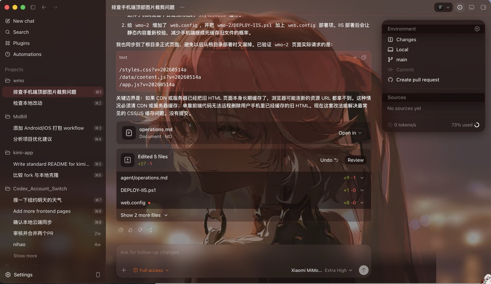
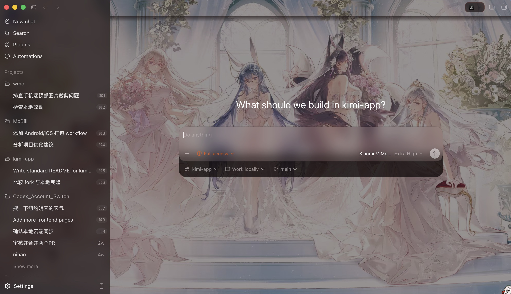
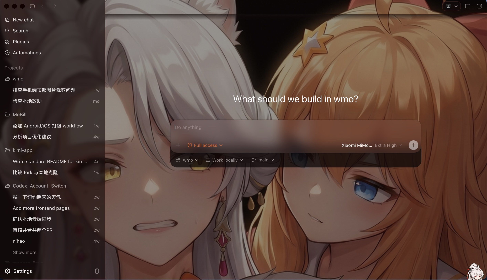
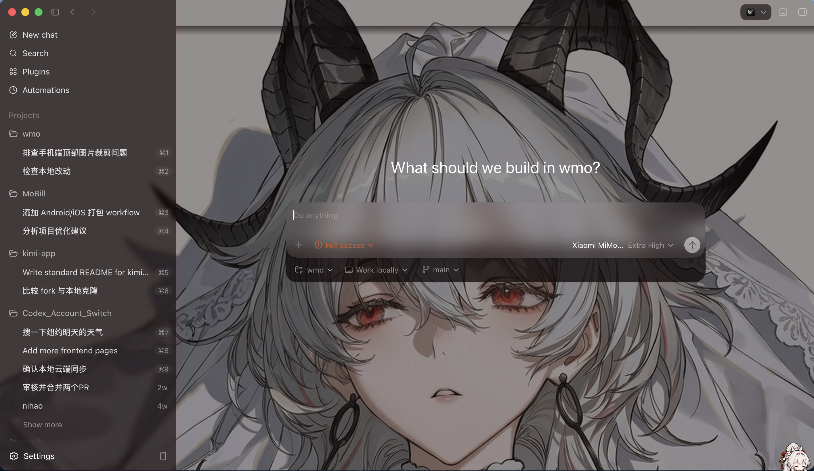

# Codex App Transfer

> [!IMPORTANT]
> 🔴 **测试覆盖范围说明**
>
> 本项目当前**仅对 Kimi For Coding、Xiaomi MiMo(Token Plan)两家供应商完成了端到端真机实际测试**。
>
> 其他已内置的 chat-completions 兼容供应商(包括 **DeepSeek、Kimi(月之暗面)、Xiaomi MiMo(Pay for Token)、智谱 GLM、阿里云百炼(API Key / Token Plan)、MiniMax**)**未做长期真机回归**,仅停留在单元测试 + 偶发用户反馈层面。
>
> 如果你愿意**提供其他供应商的 API key 用于测试**,将万分感激!可通过 **QQ:`3216202644`** 或邮箱联系作者,作者保证 **API key 仅用于本项目实际测试**。

<p align="center">
  <a href="README.md">简体中文</a> |
  <a href="README.en.md">English</a> |
  <a href="CHANGELOG.md">Changelog</a> |
  <a href="https://cmochance.github.io/codex-app-transfer/">Code Graph</a>
</p>

<p align="center">
  <a href="https://github.com/Cmochance/codex-app-transfer/stargazers"></a>
  <a href="LICENSE.txt"></a>
  <a href="https://www.rust-lang.org/"></a>
  <a href="https://v2.tauri.app/"></a>
  <a href="https://github.com/Cmochance/codex-app-transfer/releases"></a>
</p>

Codex App Transfer 是一个面向 **OpenAI Codex APP** 的轻量桌面配置 + 转发工具。它在本机起一个网关,把 Codex APP 发出的 Responses API 请求(HTTP 流式 / 非流式 + `/responses` )翻译成 Chat Completions 等格式,转发到你选择的供应商，用桌面 UI 管理供应商、模型映射、转发端口、日志面板,让 Codex APP 无缝使用第三方 chat/completions 协议的推理服务。

启动转发后,Codex APP 通过本机 `127.0.0.1:18080` 与本工具通信。关闭窗口会缩到系统托盘继续运行,右键托盘"退出"才完全退出。

当前版本 **v2.1.18**(详见 [Changelog](CHANGELOG.md) 与 [Releases](https://github.com/Cmochance/codex-app-transfer/releases))。

## 界面预览

| 仪表盘 | 供应商 |
|---|---|
|  |  |
| **设置** | **日志** |
|  |  |

### Codex APP 实际接入

启用任意供应商后,Codex APP 模型选择器会显示「<provider> / <real-model>」形式的真实模型名,对话过程中工具循环 / `previous_response_id` 历史回放 / thinking 模式 reasoning_content 注入全部由本地代理透明处理:


### Codex Desktop 背景主题(可选)

为 Codex Desktop(Electron 客户端)注入背景图 + 半透明玻璃面板 CSS,内置 11 套二次元主题(每套按背景图独立配色)+ 自定义上传。不修改 Codex 的 binary,基于 Chromium DevTools Protocol 运行时注入,Theme 页关闭 toggle 即恢复原生 UI。

| 长离 (Changli) | 碧蓝航线 (Azur Lane) |
|---|---|
|  |  |
| **乃琳 (Nailin)** | **赞妮 (Zani)** |
|  |  |

第 6 套 Carton 自带右下角漂浮立绘(随鼠标动)。**自定义背景**:Theme 页 → "+ 添加自定义" → 选 JPG/PNG → 1:1 crop 弹窗自由选截取区域(拖拽 + 滚轮缩放)→ 应用。Codex 启动时如已开启 toggle 会自动注入已选主题,不需手动操作。

## 能做什么

- 管理多套供应商,按 OpenAI 模型名(`gpt-5.5` / `gpt-5.4` / `gpt-5.4-mini` / `gpt-5.3-codex` / `gpt-5.2`)映射到供应商真实模型 ID
- 把 Codex APP 的 Responses API 流式 / 非流式请求转换为上游协议:Chat Completions、Gemini Native(`:streamGenerateContent`)、Gemini CLI OAuth(Cloud Code Assist)、Anthropic Messages(`/v1/messages`)、Grok Web(`/rest/app-chat/conversations/new`)、Responses 透传等
- 多轮工具对话上下文 + `previous_response_id` 历史回放 + autocompact 展开 + thinking / reasoning_content 注入全部对齐 OpenAI Responses API 协议
- Codex APP 的 freeform `apply_patch` 工具(编辑文件 +/- diff UI)在 DeepSeek / Kimi / MiMo 等 chat-completions provider 上正常工作:adapter 双向桥接 Responses `custom_tool_call` ↔ chat `function_call` 形态,模型按 V4A 格式生成 patch,Codex APP 渲染为 diff(issue #235);Gemini 系(gemini_native + Cloud Code Assist / Antigravity,走 generateContent)已通过 MOC-75 修复同款桥接:请求侧把 freeform `custom` 工具降级成带 `input` 参数的 function(V4A description 复用 chat 常量),响应侧把 Gemini 回来的 `functionCall` 重打包成 `custom_tool_call` wire
- Gemini 系(gemini_native + Cloud Code Assist / Antigravity)上游返 4xx/5xx 时,proxy 把错误翻译成 Codex 能识别的 `response.failed`,且 `error.code` 对齐 Codex 的重试白名单:**无歧义永久性**错误(400 INVALID_ARGUMENT / 401 鉴权 / 403 权限)直接 surface 给用户 + 停手(可换模型),不再让 Codex 反复重发同一请求卡死;**瞬时或不确定**错误(超时 / 限流 / 配额 / 5xx)保留可重试语义(指数退避;真不可恢复的退避到上限后 surface)(MOC-79)
- Grok Web 上游返 4xx/5xx 时同上对齐 Codex 重试白名单:401 鉴权 / 403 权限 → `invalid_prompt`(永久,Codex surface + 停),不再让 Codex 反复重发卡死;瞬时错误(timeout / rate_limited / server_error)保留可重试语义(MOC-90)
- 会话历史**两层持久化**:L1 内存 LRU + L2 sqlite 30 天 TTL(`~/.codex-app-transfer/sessions.db`),`.app` 重启不丢历史
- **用量统计**(Sidebar → 用量):解析 `~/.codex/sessions/` rollout JSONL,按对话 / 日 / 模型聚合 token 用量(解析层 vendor 自 ryoppippi/ccusage)。「按对话」视图显示每对话**缓存命中率**,点击数字弹出该对话**逐轮命中率直方图**(命中含于总计、双色,hover 看命中 / 总输入 / 输出);proxy 本地记录 `session → 真实上游模型`(本版本之后的新对话),「按对话」模型列因此显示真实上游模型而非 Codex 客户端占位名(`gpt-5.x`)
- Codex APP 原配置守护:apply 前自动快照 `~/.codex/{config.toml,auth.json}`,退出 / 下次启动按 key 智能合并还原;**MCP 授权可移植保险箱**(默认开):把 MCP OAuth 凭据改存为可移植文件(`~/.codex/.credentials.json`,0o600),并在 `~/.codex` 之外维护镜像(`~/.codex-app-transfer/mcp-credentials.json`);整个凭据文件被账号切换 / 误删 / 换机清掉时,下次启动弹确认让你从备份恢复(单个 server 的主动登出会被尊重、不复活;注:不解决 OAuth 自然过期)
- **Codex 文档管理**(Sidebar → Codex):
  - **Agents**:任意位置 `AGENTS.md` raw 全文 read/write + 文件系统选择;按 `.git/` 自动分类 project-root / subdir 显示 chip
  - **Memories**:固定管理 `~/.codex/memories/MEMORY.md`(主索引)+ `memory_summary.md`(摘要)— codex 唯二 user-editable 的 AI 实际读取索引
  - **Skills**:扫描 `~/.codex/skills/<name>/SKILL.md` 全列表 raw 编辑;"打开文件夹"按钮调系统 `open` 让用户在 Finder/资源管理器 改 SKILL.md 之外的子文件(scripts / examples / templates 等)
  - **MCP**:结构化 JSON 编辑 `~/.codex/config.toml` 的 `[mcp_servers.*]` 节(`toml_edit` round-trip 保留注释 + 其他配置节)+ Plugins 子页扫 `~/.codex/plugins/cache/` 列已安装 plugin(enable toggle / uninstall);所有改动 atomic write + 独立 history 互不交叉(SHA-256 hash 路径)
- 实时日志面板,2 秒自动刷新;统一 `tracing::warn!(error_id, detail)` + 稳定 token,operator 可 grep / 聚合
- 反馈弹窗附带诊断材料(环境信息、脱敏配置、最近错误快照及完整请求 / 响应),减少手工补材料
- 中文 / 英文界面,浅色 / 深色 / 绿色 / 橙色 / 灰色 / 白色多种主题
- **注入的 system prompts 跟随界面语言**:本项目对非 OpenAI provider 注入的 `apply_patch` chat-path 规则 + autocompact 总结提示词,跟设置里 `语言 / Language` 一致(中文用户 → 中文 prompt,避免模型中英混杂思考);V4A 关键字(`*** Begin Patch` / `@@ <header>` 等)+ Codex CLI 错误消息原文保英文(parser / matcher 不接受翻译)
- **Codex Desktop 主题(可选,默认关)**:Theme 页内置 11 套动漫主题(`carton` 含浮动看板娘,其余 `changli` / `azurlane` / `nailin` / `zani` / `frost` / `nocturne` / `duet` / `rose` / `sonata` / `studio`),每套按背景图独立调出暗玻璃 + 强调色。通过 CDP 向 Codex Desktop 注入设计令牌覆盖(`--color-token-*` + 运行时 `--color-*` 层)+ 背景图,覆盖聊天 / 设置页 / 折叠侧栏 / 弹层等各视图。开关跟 Plugin Unlock 独立,page reload 自动重应用
- 跨平台单实例锁定(双击启动自动唤起已有窗口)+ 跨进程 file lock 防多实例同时写 config 丢更新
- Windows / macOS / Linux 系统托盘

## 下载

最新版:`https://github.com/Cmochance/codex-app-transfer/releases/latest`

推荐资产命名:

```text
Codex-App-Transfer-v<版本>-Windows-x64-Setup.exe       Windows NSIS 安装版(推荐)
Codex-App-Transfer-v<版本>-Windows-x64.msi             Windows MSI(企业 MDM / GPO)
Codex-App-Transfer-v<版本>-macOS-arm64.dmg             macOS Apple Silicon
Codex-App-Transfer-v<版本>-macOS-x64.dmg               macOS Intel x64(v2.1.0+,close #61)
Codex-App-Transfer-v<版本>-Linux-x86_64.deb            Debian / Ubuntu
Codex-App-Transfer-v<版本>-Linux-x86_64.AppImage       通用 Linux x86_64,`chmod +x` 直接跑
```

每个二进制都附带 `.sha256` 与 `.sig`(RSA-3072 PKCS#1 v1.5 + SHA-256 签名);公钥 `Codex-App-Transfer-release-public.pem` 跟随每个 Release 一起发布,直接从 [Releases](https://github.com/Cmochance/codex-app-transfer/releases) 下载即可验签。

Windows 暂未做 Authenticode 代码签名,系统可能提示未知发布者,可用 `.sha256` / `.sig` 校验下载完整性。
macOS 暂未做 **Apple Developer ID 代码签名** 与 **Apple 公证(Notarization)**,首次打开会被 Gatekeeper 拦截,提示「无法打开,因为它来自身份不明的开发者」。绕过方式:`右键 → 打开` 一次性放行;或用 `.sha256` / `.sig` 校验下载完整性后,在 `系统设置 → 隐私与安全性` 点「仍要打开」。

## 快速开始

1. 启动 Codex App Transfer,弹出桌面窗口
2. 在仪表盘点右上角加号 → 选择 preset 或自定义供应商,填入 API Base URL、API Key、获取模型、添加模型映射
3. 点击页面底部的 应用 按钮即可写入配置（toast 提示已同步;如果已配置好提供商，直接点击主页面提供商卡片上的 应用 按钮即可）
4. 让 Codex Desktop 生效:点击右上角 ↻ **重启 Codex** 按钮(#281 起从强制 modal 解耦,避免误触杀进程丢上下文)

## 供应商兼容矩阵

| Provider | 多轮历史 | autocompact | tool_call_repair | 备注 |
|---|---|---|---|---|
| Kimi(Moonshot Platform / Kimi For Coding) | ✅ | ✅ | ✅ | thinking 三层防御 |
| DeepSeek V4(含 Max 思维) | ✅ | ✅ | ✅ | 视觉输入剥离避免 400;xhigh → max 真实到达(#254) |
| Xiaomi MiMo(Token Plan / Pay for Token) | ✅ | ✅ | ✅ | 纯图请求兜底空格 text part |
| MiniMax M2.x / Text-01 | ✅ | ✅ | ✅ | `role=system` 转 user 防 400(v2.1.6) |
| Google AI Studio(`gemini_native`) | ✅ | ✅ | ✅ | Gemini 3 `/v1alpha` + Gemini 2.x `/v1beta` 自动选 |
| Google Gemini CLI OAuth | ✅ | ✅ | ✅ | 浏览器登录 Google 一次,免 API key |
| Anthropic Messages(custom Claude-compatible) | ✅(PR #153) | ✅(PR #153) | ✅(PR #153) | `apiFormat=anthropic_messages`,Claude preset 待真实验证后开放 |
| Grok Web(SuperGrok / X Premium+) | ✅ | ✅ | ✅(v2.1.6 加 tool_calls flatten) | 实验性,TOS 灰色,仅本机个人使用 |
| Google Antigravity OAuth | ✅ | ✅ | ✅ | 后端就绪,UI 待 PR |
| 智谱 GLM(5.1 / 4.7) | ✅ | ✅ | ✅ | OpenAI Chat 兼容反代 |
| 阿里云百炼(Qwen 3.6 Plus / Flash) | ✅ | ✅ | ✅ | OpenAI Chat 兼容反代 |
| Responses 协议透传(custom) | — | — | — | 直连上游不经代理,**仅写上游 base_url + key**(不注入 transfer 沙箱 / 模型目录,#317);适合 OpenAI 官方 / 原生 Responses 反代;⚠️ Plugins/MCP `namespace` 工具包不展平,部分上游会静默丢工具 |

> **MCP 工具(Codex 0.130+ `tool_search` 机制)**:Codex 0.130+ 把 server-side MCP 工具(`mcp__notion__*` / `mcp__linear__*` 等)defer 到 `tool_search`,不再直接放进 `tools[]`。代理在 **chat 路径**已打通全链路 —— 从 `tool_search_output` 发现工具 → 注入 chat `tools[]` → 按 `namespace` 路由回上游(#293)。**上表所有 chat-compat provider 通用**;仅 Responses 协议透传(末行,不经代理)不适用。

## 思考程度档位映射(chat 协议 `reasoning_effort`)

Codex 的 `low/medium/high/xhigh` 在各 chat-completions 上游的处理方式(issue #254):

| Provider | `xhigh` / `max` | 其他档位 | 备注 |
|---|---|---|---|
| **DeepSeek V4** | `reasoning_effort: "max"` | `low/medium/high` → `"high"` | 唯一接受 max 档的 chat 上游 |
| **Kimi / Kimi Code / GLM / 阿里云百炼 / Xiaomi MiMo / MiniMax** | 不传字段 | 不传字段 | 上游不认 `reasoning_effort`,用自家默认 thinking;如需控制在 `requestOptions` 写 provider-native 字段 |
| **自定义 chat-compat** | clamp 到 `"high"` | 同名透传 | OpenAI 标准 enum 保守 fallback |

## 模型映射

Codex APP 按 OpenAI 模型名提示;第三方 provider 用 `deepseek-v4-pro` / `kimi-k2.6` / `glm-5.1` / `gemini-3-pro` 等真实 ID。

本工具用 `provider.models[slot]`(`gpt-5.5` → `deepseek-v4-pro` 等)做槽位映射,Codex APP 模型选择器看到 `<provider> / <real-model>` 形式真实模型名;上游 `chatcmpl-...` 应答 ID 自动重写为 Codex APP 校验通过的 `resp_<base64>`,保留 deployment affinity 编码,`previous_response_id` 跨轮一致。

## 本地开发(v2 / Rust)

```bash
git clone https://github.com/Cmochance/codex-app-transfer.git
cd codex-app-transfer
cargo tauri dev          # 启动桌面窗口,代码改动自动重编译
cargo test --workspace --lib   # 跑单元测试
make mac-app             # macOS 本地打包到 dist/mac/
```

Fixture 反向 diff(契约测试):

```bash
cargo run --bin xtask -- gen-fixtures
```

打包(参考 `.github/workflows/release.yml`):

```bash
cargo tauri build --bundles app,dmg          # macOS arm64
cargo tauri build --bundles nsis,msi         # Windows x64
cargo tauri build --bundles deb,appimage     # Linux x86_64
```

### 想改 UI 样式怎么改

`frontend/css/` 走"组件库"形式拆开,不需要全文 grep `style.css`:

| 想改什么 | 改哪个文件 |
|---|---|
| 主题色 / 圆角 / 阴影 / 间距等 design tokens | `frontend/css/tokens.css`(129 vars + 6 套主题) |
| 全局 reset / body 字体 / focus 描边 | `frontend/css/base.css` |
| 按钮 / 卡片 / 表单 / 徽章 / 模态等组件 | `frontend/css/components/<name>.css` |
| 仪表盘 / 提供商 / 转发 / 设置 / 引导某一页专属样式 | `frontend/css/pages/<route>.css` |
| 响应式断点 / 1100px / 720px | `frontend/css/responsive.css` |

预览所有组件 + 各状态 + 主题切换:

```bash
# 浏览器直接打开(不需 dev server)
open frontend/gallery.html        # macOS
xdg-open frontend/gallery.html    # Linux
start frontend/gallery.html       # Windows
```

`gallery.html` 顶部有主题切换 + 深浅色按钮,改 component css 后刷新即看。`frontend/index.html` 主入口 `<link href="css/style.css">` 不需要改 — `style.css` 只是 @import 入口聚合所有子文件。

加新组件: 在 `components/` 建 `<name>.css` + 在 `style.css` 加一行 `@import url("components/<name>.css");` + 在 `gallery.html` 加 section。

## 常见问题

### Codex 模型不能用 curl 等联网命令 / 弹审批弹窗

curl 命令需要高级权限，目前第三方模型在macOS端无法触发提权选择，因此本应用默认在 apply 时把 `sandbox_mode = "danger-full-access"` + `approval_policy = "never"` 同时写入 `~/.codex/config.toml`，若在Windows端使用或是有其他原因可在 设置 → "允许 Codex 联网工具(全权限模式)" 开关里关闭(#215)。

> **⚠️ 安全权衡**:full-access 模式模型可读写任何文件 + 所有命令无审批 = **完全信任模型**(等同 Codex 官方文档的 "Full access" 档位)。toggle off 后 Codex 回 read-only 沙箱 + on-request 审批。macOS目前无法触发提权选择，无网络,仅能用所选模型自带的 `web_search` 能力;若模型不支持 web_search 则所有搜索操作只会返回空内容。

### Codex APP 提示 `404 Not Found url: http://127.0.0.1:18080/responses`

老版本只有 `/v1/responses`,Codex CLI 0.126 起回退到 `/responses`(不带 `/v1/`)。本工具已加路由别名,更新到 v1.0.1+ 即可。

### Codex APP 提示 `stream disconnected before completion`

通常是 `response.id` / `response.model` 没按 Codex APP 期望填回。本工具把上游 `chatcmpl-...` 重写成 `resp_<base64>` 并保留请求模型名,请确认转发日志确实看到 `resp_...` 而不是 `chatcmpl-...`。

### 上游 400:`thinking is enabled but reasoning_content is missing`

Kimi / DeepSeek 开启 thinking 后强制要求历史中带 tool_call 的 assistant 消息提供 `reasoning_content`。v1.0.1+ 已自动补默认空字符串,并把 Responses 输入里的 reasoning items 映射到对应 assistant 消息。

### 上游 400:`'reasoning_effort' does not support 'xhigh'`

v2.1.14 及之前会把 `xhigh` / `max` 一刀切降级到 `high`(issue #254)。**v2.1.15+ 改为 per-provider 策略** — DeepSeek 真实 xhigh→max 到达;Kimi / GLM / MiMo / MiniMax / Qwen 不发该字段(上游不认);自定义保守 clamp。完整映射见上方 [思考程度档位映射](#思考程度档位映射reasoning_effort--上游)。

`auto` / `none` / `disabled` 等 Chat 端不接受的值始终丢弃。

### MiniMax 400:`invalid message role: system (2013)`

v2.1.5 及之前的版本未把 `role=system` 转 `role=user`,导致 MiniMax `/v1/chat/completions` 整请求 400。v2.1.6+ 已修(close #139),所有 `role=system` 消息转 `role=user` + content 前置 `[System]\n` marker。

### 上游 404 / 连不上(Base URL 填了完整 endpoint)

provider 的 Base URL 只填到根或 `/v1`(例 `https://api.example.com/v1`),**不要**把完整 endpoint 路径整段粘进去。本工具会按协议自动补 `/chat/completions`、`/v1/messages`、`/responses` 等;若 Base URL 已含这些后缀(如把 `https://opencode.ai/zen/go/v1/chat/completions` 整段填入),会拼成 `…/chat/completions/chat/completions` 导致上游 404。删掉多余的 endpoint 后缀、只留到 `/v1` 即可。

### Codex 提示 `Failed to revert changes`

这是 Codex 客户端本地"撤销更改"操作的提示,**不经过本工具的代理**(回退由 Codex 用它维护的本地文件快照完成,与所选模型 / 中转无关)。常见原因:① 改动的文件被编辑器 / IDE / 杀毒软件占用,Windows 下回滚写不进;② 文件在 Codex 改完后又被外部改动,快照对不上无法回退;③ 本次会话 apply_patch 把文件写进了嵌套子目录,路径错乱时找不到原文件。排查:关掉占用文件的程序、确认改动落在预期目录后重试;仍失败可手动改回。

### 端口冲突

v2 默认监听 `18080`(转发);管理界面走 Tauri 同进程 `cas://`,不再占用 18081。`netstat -ano | findstr :18080` 查占用,或在 设置 → 端口 改成空闲端口后重启转发。

### Windows 提示未知发布者

当前 Windows 构建未做 Authenticode 代码签名。Release 页提供 `.sha256` 与 `.sig`,可用于校验安装包未被替换。

### 自定义 Update URL / Self-host 自签

v2.1.12+ 的客户端 **强制** RSA-3072 PKCS#1-v1.5-SHA256 验签 `latest.json` 跟 installer:升级流程会主动拉 `<url>.sig` + 用 build-time 嵌入的官方公钥 (`release/Codex-App-Transfer-release-public.pem`) 验,失败硬 fail 不 fallback 到 SHA256-only。

**自定义 update URL 必须自签才能用**:

1. fork 仓库,把 `release/Codex-App-Transfer-release-public.pem` 换成你自己的公钥
2. 用对应私钥跑 `cargo run -p xtask --release -- release-bundle` 签 `latest.json` + 每个 installer
3. 重 build 客户端,公钥嵌进二进制
4. 用户在 设置 → Update URL 填你的 `latest.json` 地址

设计意图: 客户端只信"build-time 嵌入的公钥"产生的签名,运行时不可替换公钥,防 MITM 改 `latest.json` 推任意 installer (公钥 PEM 已在 release/ 目录,但若让客户端动态从 update URL 旁边拉公钥就破坏 trust anchor)。

### 日志

- 应用界面:转发页面下方实时面板,2 秒自动刷新
- 磁盘文件:`~/.codex-app-transfer/logs/proxy-YYYY-MM-DD.log`,点"查看日志"按钮直接打开
- 清除日志:把当前日志移到 `logs/backup/` 并加时间戳后缀,不直接删除

## 技术栈

- **后端 / 转发**:Rust 1.80+ · axum 0.8 · reqwest 0.12(rustls-tls)· tokio
- **协议适配**:`crates/adapters/` — Responses ↔ Chat / Gemini Native / Gemini CLI OAuth / Anthropic Messages / Grok Web 互转(请求 body + 流式响应状态机 + reasoning_content + tool_calls)
- **前端**:HTML + CSS + 原生 JavaScript + Bootstrap 5.3.3(本地化,无 CDN 依赖)
- **桌面壳**:Tauri 2 + tray-icon 0.23,通过 `cas://` URI scheme 把 frontend/ 与 axum 同进程串起来,无 TCP loopback
- **存储**:`~/.codex-app-transfer/config.json`(配置,与 v1.x 互通)、`~/.codex-app-transfer/sessions.db`(L2 sqlite 会话持久化)、`~/.codex/{config.toml,auth.json,.credentials.json}`(Codex APP 集成)、`~/.codex-app-transfer/mcp-credentials.json`(MCP 凭据镜像,在 `~/.codex` 之外)
- **打包**:`cargo tauri build` 单命令出 dmg/AppImage/deb/exe/msi;`xtask release-bundle` 收口出 sha256 + RSA-3072 sig + latest.json + draft GitHub release

## 免责声明

本项目专注 **OpenAI Codex APP** 接入,**不是** OpenAI / Anthropic / Google / xAI 的官方项目,也不复用其商标 / Logo / 发布身份。

上游 API key / OAuth token 仅保存在本机 `~/.codex-app-transfer/`(Unix 0600 + atomic write);转发服务只监听 `127.0.0.1`,不接管系统代理，除反馈功能外不涉及第三方联网行为。

部分实验性 provider(Grok Web / Gemini CLI OAuth / Antigravity OAuth)涉及上游 TOS 灰色地带 — Grok Web 反代 grok.com Web 后端协议、Gemini CLI OAuth 借用 `cloudcode-pa.googleapis.com/v1internal` 内部端点 — 严格限定**个人使用**,**不应**作为对外服务发布,且存在封号风险，**用户自担风险**。这些灰色 provider 在「添加提供商」列表中**默认隐藏**,需到设置页打开「**显示灰色提供商**」开关才出现(MOC-91)。

## 致谢

> 以下列表为概览。**完整借鉴形式 / 借鉴清单 / 本项目对应 file:line** 见 [ACKNOWLEDGEMENTS.md](./ACKNOWLEDGEMENTS.md)。

<!-- 致谢概览规则:每条 " — " 之后的描述 ≤ 20 字(极简标签,只写"借鉴了什么");完整借鉴形式 / license / file:line 一律进 ACKNOWLEDGEMENTS.md。长度由 scripts/check_acknowledgements.py 在 CI 强制,超标即 fail。 -->

- [`farion1231/cc-switch`](https://github.com/farion1231/cc-switch) — provider 切换形态启发
- [`lonr-6/cc-desktop-switch`](https://github.com/lonr-6/cc-desktop-switch) — v1.x 桌面壳骨架
- [`BerriAI/litellm`](https://github.com/BerriAI/litellm) — 协议双向转换思路
- [`tauri-apps/tauri`](https://tauri.app/) — v2 + `cas://` 架构基座
- [`openai/codex`](https://github.com/openai/codex) — compact prompt 骨架
- [`Piebald-AI/claude-code-system-prompts`](https://github.com/Piebald-AI/claude-code-system-prompts) — prompt 锚定 bullet
- [`7as0nch/mimo2codex`](https://github.com/7as0nch/mimo2codex) — MiMo 协议借鉴
- [`router-for-me/CLIProxyAPI`](https://github.com/router-for-me/CLIProxyAPI) — Gemini OAuth wire 参考
- [`chenyme/grok2api`](https://github.com/chenyme/grok2api) — Grok Web 反向工程参考
- [`galaxywk223/codex-plugin-unlocker`](https://github.com/galaxywk223/codex-plugin-unlocker) — Plugins 解锁注入脚本
- [`QwenLM/qwen-code`](https://github.com/QwenLM/qwen-code) — Qwen 模型清单硬编码
- [`BigPizzaV3/CodexPlusPlus`](https://github.com/BigPizzaV3/CodexPlusPlus) — Windows CDP 注入路径
- [`borawong/AiMaMi`](https://github.com/borawong/AiMaMi) — 受管块六操作设计
- [`ryoppippi/ccusage`](https://github.com/ryoppippi/ccusage) — rollout token 用量解析

### 社区贡献者

通过 PR 直接改进过本项目的贡献者(按首次提交时间倒序;完整列表见 [Contributors](https://github.com/Cmochance/codex-app-transfer/graphs/contributors)):

- [@Alpaca233114514](https://github.com/Alpaca233114514) — 背景主题 CDP drain_until_response + 检查更新 gzip/OnceLock 修复([#278](https://github.com/Cmochance/codex-app-transfer/pull/278) / [#285](https://github.com/Cmochance/codex-app-transfer/pull/285))
- [@lukegood](https://github.com/lukegood) — MiniMax M2.x 兼容性([#47](https://github.com/Cmochance/codex-app-transfer/pull/47))
- [@cw881014](https://github.com/cw881014) — 早期协议层 3 PR([#1](https://github.com/Cmochance/codex-app-transfer/pull/1) / [#7](https://github.com/Cmochance/codex-app-transfer/pull/7) / [#12](https://github.com/Cmochance/codex-app-transfer/pull/12))

如果提交过 PR 想改名 / 补链接 / 移除,开 issue 跟我说一声。

## 许可证

MIT License。完整文本见 [LICENSE.txt](LICENSE.txt)。

## 项目活跃度

<table>
<tr>
<td width="50%" align="center">
<a href="https://github.com/Cmochance/codex-app-transfer/releases"></a>
<br/><sub>下载量趋势</sub>
</td>
<td width="50%" align="center">
<a href="https://star-history.com/#Cmochance/codex-app-transfer&Date"></a>
<br/><sub>Star 趋势</sub>
</td>
</tr>
</table>
