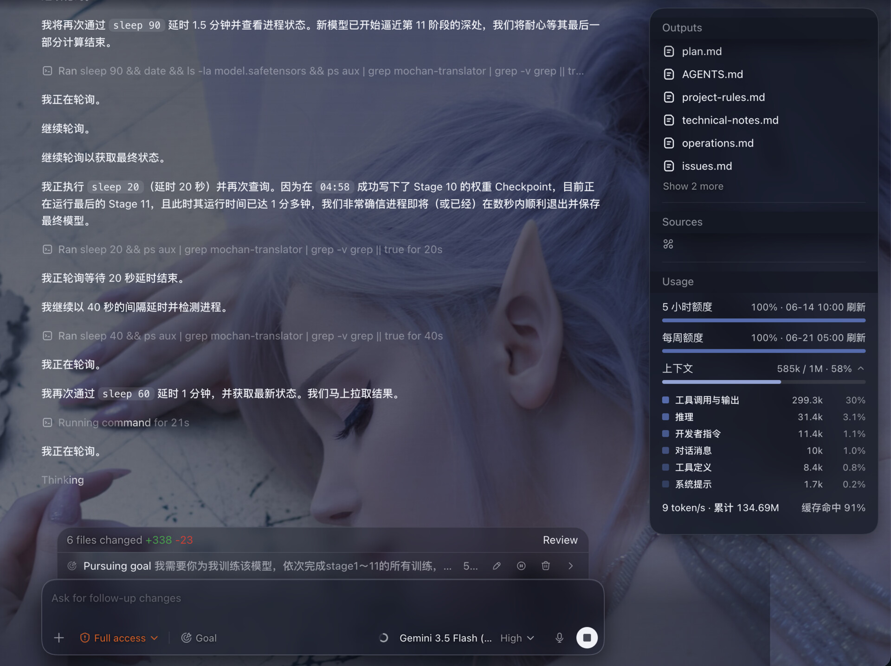

# Codex App Transfer

> [!IMPORTANT]
> 🔴 **测试覆盖范围说明**
>
> 本项目当前**仅对 Kimi For Coding、Xiaomi MiMo(Token Plan)两家供应商完成了端到端真机实际测试**。
>
> 其他已内置的 chat-completions 兼容供应商(包括 **DeepSeek、Kimi(月之暗面)、Xiaomi MiMo(Pay for Token)、智谱 GLM、智谱 GLM Coding、GLM（Z.ai）(zai-login)、GLM（BigModel）(bigmodel-login)、阿里云百炼(API Key / Token Plan)、MiniMax**)**未做长期真机回归**,仅停留在单元测试 + 偶发用户反馈层面。
>
> 如果你愿意**提供其他供应商的 API key 用于测试**,将万分感激!可通过 **QQ:`3216202644`** 或邮箱联系作者,作者保证 **API key 仅用于本项目实际测试**。

<p align="center">
  <a href="README.md">简体中文</a> |
  <a href="README.en.md">English</a> |
  <a href="CHANGELOG.md">Changelog</a> |
  <a href="https://cmochance.github.io/codex-app-transfer/">Code Graph</a>
</p>

<p align="center">
  <a href="https://github.com/Cmochance/codex-app-transfer/stargazers"></a>
  <a href="LICENSE.txt"></a>
  <a href="https://www.rust-lang.org/"></a>
  <a href="https://v2.tauri.app/"></a>
  <a href="https://github.com/Cmochance/codex-app-transfer/releases"></a>
</p>

Codex App Transfer 是一个面向 **OpenAI Codex APP** 的轻量桌面配置 + 转发工具。它在本机起一个网关,把 Codex APP 发出的 Responses API 请求(HTTP 流式 / 非流式 + `/responses` )翻译成 Chat Completions 等格式,转发到你选择的供应商，用桌面 UI 管理供应商、模型映射、转发端口、日志面板,让 Codex APP 无缝使用第三方 chat/completions 协议的推理服务。

启动转发后,Codex APP 通过本机 `127.0.0.1:18080` 与本工具通信。关闭窗口会缩到系统托盘继续运行,右键托盘"退出"才完全退出。

当前版本 **v2.3.4**(详见 [Changelog](CHANGELOG.md) 与 [Releases](https://github.com/Cmochance/codex-app-transfer/releases))。

## 界面预览

| 仪表盘 | 供应商 |
|---|---|
|  |  |
| **设置** | **日志** |
|  |  |

### Codex APP 实际接入

启用任意供应商后,Codex APP 模型选择器会显示「<provider> / <real-model>」形式的真实模型名,对话过程中工具循环 / `previous_response_id` 历史回放 / thinking 模式 reasoning_content 注入全部由本地代理透明处理:


### Codex Desktop 背景主题(可选)

为 Codex Desktop(Electron 客户端)注入背景图 + 半透明玻璃面板 CSS,内置 11 套二次元主题(每套按背景图独立配色)+ 自定义上传。不修改 Codex 的 binary,基于 Chromium DevTools Protocol 运行时注入。开关为持久化状态标记:开启时落盘保存并即时注入(best-effort),若当前 Codex 未经本工具启动 / 调试端口不可用,则弹确认提示是否重启 Codex 让主题生效;关闭时只落盘清除偏好,已注入的主题保留至 Codex 下次重启自然消失。

| 长离 (Changli) | 碧蓝航线 (Azur Lane) |
|---|---|
|  |  |
| **乃琳 (Nailin)** | **赞妮 (Zani)** |
|  |  |

第 6 套 Carton 自带右下角漂浮立绘(随鼠标动)。**自定义背景**:Theme 页 → "+ 添加自定义" → 选 JPG/PNG → 1:1 crop 弹窗自由选截取区域(拖拽 + 滚轮缩放)→ 应用。Codex 启动时如已开启 toggle 会自动注入已选主题,不需手动操作。

### Codex 内用量显示(可选)

在 Codex Desktop 顶栏「Toggle pinned summary」弹窗底部注入独立「Usage」分区:5 小时 / 每周额度(白名单 provider:antigravity gemini 系 + GLM Coding Plan + 小米 MiMo Token Plan)、余额 / 已用额度数值(DeepSeek / Kimi 月之暗面 / anyrouter)、上下文用量、实时 Tokens 速率与累计、缓存命中率。其中**上下文**行可展开 Claude 风格的 by-source 明细下拉(按发往上游的内容分类:工具调用与输出 / 推理 / 开发者指令 / 对话消息 / 工具定义 / 系统提示),数据按对话持久化、启动即用。详见下方「能做什么」。



## 能做什么

- 管理多套供应商,按 OpenAI 模型名(`gpt-5.5` / `gpt-5.4` / `gpt-5.4-mini` / `gpt-5.3-codex` / `gpt-5.2`)映射到供应商真实模型 ID
- 把 Codex APP 的 Responses API 流式 / 非流式请求转换为上游协议:Chat Completions、Gemini Native(`:streamGenerateContent`)、Gemini CLI OAuth(Cloud Code Assist)、Anthropic Messages(`/v1/messages`)、Grok Web(`/rest/app-chat/conversations/new`)、Responses 透传等
- 多轮工具对话上下文 + `previous_response_id` 历史回放 + autocompact 展开 + thinking / reasoning_content 注入全部对齐 OpenAI Responses API 协议;remote compact 新旧协议双轨支持:旧版 `/responses/compact` 端点 + 新版 remote compaction v2(普通流式 `/responses` 带 `compaction_trigger` 标记,响应回单个 compaction item 的 SSE 流)——新版 Codex 触发自动压缩时此前会报 `expected exactly one compaction output item` 已修(MOC-198)
- 思考过程(reasoning)在新版 Codex Desktop(v26.608+)正常显示:新版渲染读 reasoning **content 通道**(`reasoning_text` + `content_index`)而非旧 summary 通道,gemini_native / chat 路径已双发两通道兼容新旧版;chat 路径同时修复 reasoning 与 tool_call 流式事件交错(开工具前先闭合 reasoning)、gemini 修复工具调用折叠(`functionCall` 后空 text part 不再产生空 message item,同轮工具正常折叠成组)(MOC-203)
- Codex APP 的 freeform `apply_patch` 工具(编辑文件 +/- diff UI)在 DeepSeek / Kimi / MiMo 等 chat-completions provider 上正常工作:adapter 双向桥接 Responses `custom_tool_call` ↔ chat `function_call` 形态,模型按 V4A 格式生成 patch,Codex APP 渲染为 diff(issue #235);Gemini 系(gemini_native + Cloud Code Assist / Antigravity,走 generateContent)已通过 MOC-75 修复同款桥接:请求侧把 freeform `custom` 工具降级成带 `input` 参数的 function(V4A description 复用 chat 常量),响应侧把 Gemini 回来的 `functionCall` 重打包成 `custom_tool_call` wire
- **apply_patch 中间层(格式恢复)**:第三方 chat 模型无 GPT 的 lark 语法约束生成,常产出畸形 V4A(双边 `@@`、Add File 漏 `+`、上下文 byte 失配、缺 `*** Begin/End Patch` 信封、漏空行、漏前缀等)。中间层按**白名单逐条恢复**成合法格式再发 Codex —— 读盘把 `@@` 锚点 / 上下文对齐成文件真实字节、补回漏写空行、空文件 / 空 rename 转 `Delete+Add` 等;**非破坏性**(不丢内容、不覆盖)、**未知一律原样透过**(交 Codex 报错让模型自纠,不猜)。思路镜像 Codex 给 GPT 用的 V4A lark 语法约束、在 chat 路径事后保证(致谢 [openai/codex](https://github.com/openai/codex) 的 apply_patch lark grammar)(MOC-194)
- **Antigravity 原生图像生成**(MOC-210):Codex 内置的 `image_gen` 工具在 Antigravity provider 上真正出图(原生,非 CLI fallback)。模型在对话里调 `image_gen` 时,代理在 Gemini 响应流里截获该调用、发出图子请求(默认 `gemini-3.1-flash-image`,可在 provider 配置页 `gpt-image-1` 槽位覆盖),把返回的图片内联成 `image_generation_call` 回流给 Codex 渲染;文本/思考照常实时流式,出图轮记入历史避免重复出图。该工具仅对 Antigravity 暴露(其余 provider 无出图后端)。
- Gemini 系(gemini_native + Cloud Code Assist / Antigravity)上游返 4xx/5xx 时,proxy 把错误翻译成 Codex 能识别的 `response.failed`,且 `error.code` 对齐 Codex 的重试白名单:**无歧义永久性**错误(400 INVALID_ARGUMENT / 401 鉴权 / 403 权限)直接 surface 给用户 + 停手(可换模型),不再让 Codex 反复重发同一请求卡死;**瞬时或不确定**错误(超时 / 限流 / 配额 / 5xx)保留可重试语义(指数退避;真不可恢复的退避到上限后 surface)(MOC-79)
- Grok Web 上游返 4xx/5xx 时同上对齐 Codex 重试白名单:401 鉴权 / 403 权限 → `invalid_prompt`(永久,Codex surface + 停),不再让 Codex 反复重发卡死;瞬时错误(timeout / rate_limited / server_error)保留可重试语义(MOC-90)
- chat-completions 兼容 provider(DeepSeek / Kimi / MiMo / GLM / 阿里云百炼 / MiniMax 等)上游返 4xx/5xx 时同款对齐:此前 proxy 原样透传 HTTP 错误状态 + JSON error body,Codex APP 期待 SSE 流而**卡 "Thinking"**(既不报错也不重试,无法进下一轮);现改写成合规 `response.failed` 流,400 请求错误 / 401 鉴权 / 403 权限 → `invalid_prompt`(永久,surface + 停手),429 限流 / 5xx / 超时等瞬时态保留可重试语义,与 grok / gemini 同走 `codex_retry_code` 白名单(MOC-103)
- 会话历史**两层持久化**:L1 内存 LRU + L2 sqlite(`~/.codex-app-transfer/sessions.db`),`.app` 重启不丢历史。L2 按 sha256 **内容寻址去重**(图片走 blob 外置 + 文字/工具消息整条去重,逐轮快照共享部分只存一份,实测省约 97% 消息体积),体积极小,故**持久化不过期**(旧 30 天 TTL 已移除,老会话永远续得上);存量旧库在首次启动后台静默分批迁移回收(MOC-142 / MOC-168 / MOC-170)
- **多轮重复 system 块 wire 级去重(MOC-193)**:Codex 每轮请求携带完整 env block(~37 KB),长对话累积多份相同的 system/developer 指令块;转换管道在 merge 历史后、发上游前自动去重相同块(保留首次出现以稳定 prompt-cache prefix),chat / gemini / anthropic / grok 四路径全覆盖,实测可省数十 KB/轮;session cache 保持全量原貌不受影响
- **用量统计**(Sidebar → 用量):解析 `~/.codex/sessions/` rollout JSONL,按对话 / 日 / 模型聚合 token 用量(解析层 vendor 自 ryoppippi/ccusage)。「按对话」视图显示每对话**缓存命中率**,点击数字弹出该对话**逐轮命中率直方图**(命中含于总计、双色,hover 看命中 / 总输入 / 输出);proxy 本地记录 `session → 真实上游模型`(本版本之后的新对话),「按对话」模型列因此显示真实上游模型而非 Codex 客户端占位名(`gpt-5.x`)
- **真实 ChatGPT 账号 Plugins 解锁**(relay 模式,v2.2.0):用真实账号而非 CDP 伪造登录态解锁 Codex Plugins —— 应用内调起官方 `codex login` / 从文件导入账号 / 强制兜底(原 CDP 路径) / 清除账号。relay 保留 `auth_mode=chatgpt` + tokens 让 Codex **原生**显示 Plugins 入口、消除 CDP 伪造的启动高延迟;第三方模型经 `openai_base_url` 走 proxy,账号 / 插件 backend 经 `chatgpt_base_url` 透传真 chatgpt.com。transfer **不刷新** single-use refresh token(与本机 Codex 双刷会 `refresh_token_reused` 烧号),刷新只归源头(本机 Codex 自刷 / 导入源刷 / `codex login` 自取)。配套**系统代理连通检测**:仪表盘「网络代理」状态卡 + 解锁 gate(账号有效 AND 系统代理可达才解锁,缺则引导开代理 / 登录 / 强制),探测只连代理端口、不碰 chatgpt.com。另:relay 下 transfer 不刷新 token、靠源头保鲜,但服务端撤销(双刷烧号 / 别处重登)本地 JWT `exp` 看不到 → 此前前端因本地 token 没到期而**误显账号正常**;现 proxy 透传探测到 chatgpt backend **401** 即回灌「需重新登录」状态,前端及时提示重登(MOC-104 / MOC-114 / MOC-124)
- **Codex 插件解锁三态**(MOC-257):设置页「关闭 / 模拟账号 / 真实账号」三态选择器,统一替代旧 CDP 注入(只改渲染层、`auth.json` 仍 apikey → 通信不自洽、插件跑不通)。**模拟账号**:无真实 ChatGPT 账号时写一份合规伪造的 `auth.json`(`auth_mode=chatgpt` + 合成 JWT、远未来 `exp` 防 CLI 刷新、`cas_synthetic` 哨兵)让 Codex **原生**显示 Plugins,proxy 把 Codex 发的 `/backend-api/*` 账号 / 插件请求**逐条伪造 200**(**绝不 401**,401 触发 Codex 重登),对话照常走第三方 provider(resolver 只验 JWT 形状不验签)。**真实账号**:用本机 ChatGPT 登录态 relay 透传真 chatgpt.com;账号失效(过期 / 服务端撤销)**自动降级模拟账号**(账号恢复可用自动升回),无账号时弹窗引导 `codex login`。**关闭**:真账号整文件转移备份、确保 `~/.codex` 无 auth.json,退出 transfer 时还原原配置(三态切换全程真账号 tokens 无损)
- **插件市场 + Plugins 增强(MOC-7)**:`文档 → MCP → Marketplace` 子区按分类浏览 OpenAI Codex 插件目录的镜像(178 个连接器 + 搜索 + 图标 + 官网链接),数据来自项目维护的公开 storage 仓库(`codex-app-transfer-storage`,后端经 `raw.githubusercontent.com` 直取 registry + 图标代理 + 缓存);**多源聚合**——官方源 + 「添加源」加自定义公开连接器目录(同 `{connectors}` schema)。**仅展示浏览**:这些连接器是 OpenAI 平台的 OAuth 远程连接器、由单一 `plugin-runtime` MCP server(`chatgpt.com/backend-api/ps/mcp`)统一 broker、无独立 MCP 端点,故镜像目录只含展示数据。另:`文档 → MCP → Plugins` 子页给已安装 plugin 显示图标(读 manifest `interface.logo`)+ 「Skills」按钮(弹窗看其 `SKILL.md`,多 skill 下拉选条)
- **Codex 远程控制 WS 透传**(relay 模式,MOC-125):Codex 桌面端「远程控制」(Mobile→Mac)经 `wham/remote/control/server` 发起 **WebSocket** 握手;relay 下此前 transfer 把它当普通 HTTP 透传、不做 WS upgrade → chatgpt.com 返 404 → 远程控制建不起来、Codex `enroll` 死循环重试。现加**真 WS 透传**:接收侧 axum 接 Codex 的 WS upgrade,上游侧用独立 `http1_only` client(WS upgrade 需 HTTP/1.1,而 `state.http` 默认 ALPN 协商 h2)连 `wss://chatgpt.com`、注入 Codex 的 `x-codex-installation-id` / `x-codex-server-id` / `authorization` 等远程控制必需 header,再双向 frame pump。普通转发的 `state.http`(reqwest 0.12)完全不动,WS 单独走 reqwest 0.13 client,现有上游 CF/ClientHello 指纹零变化
- Codex APP 原配置守护:apply 前自动快照 `~/.codex/{config.toml,auth.json}`,退出 / 下次启动按 key 智能合并还原;**强杀自愈**:transfer 被强杀(kill -9 / 崩溃)来不及还原时,下次启动自动发现上个 session 遗留的快照并补跑还原(此前会残留 `sandbox_mode` / 指向已停代理的 `openai_base_url`,导致 GPT 账号报「无法设置管理员沙盒」且无法对话);拍快照时同步过滤残留特征字段,防脏配置固化进还原基线;**MCP 授权可移植保险箱**(默认开):把 MCP OAuth 凭据改存为可移植文件(`~/.codex/.credentials.json`,0o600),并在 `~/.codex` 之外维护镜像(`~/.codex-app-transfer/mcp-credentials.json`);整个凭据文件被账号切换 / 误删 / 换机清掉时,下次启动弹确认让你从备份恢复(单个 server 的主动登出会被尊重、不复活;注:不解决 OAuth 自然过期);另在设置页提供**原配置完整性检查**:扫描 `~/.codex/config.toml` 与历史快照是否残留 transfer apply 写过的字段(`model_catalog_json` / `openai_base_url` 等),「显示残留字段」只读列出每个文件待清理的残留字段、「针对性清除」精准 strip(保留 model / personality / `[projects.*]` / mcp_servers 等其它配置)
- **Codex 文档管理**(Sidebar → Codex)——Agents / Memories / Skills 文档编辑后 Apply 写盘前均弹二次确认,防误改影响 AI 行为的文档(MOC-106):
  - **Agents**:HOME 下非敏感 `AGENTS.md` raw 全文 read/write + 文件系统选择;系统目录 / 凭据目录会被拒绝,按 `.git/` 自动分类 project-root / subdir 显示 chip
  - **Memories**:固定管理 `~/.codex/memories/MEMORY.md`(主索引)+ `memory_summary.md`(摘要),也可添加 HOME 下非敏感项目 `MEMORY.md`;系统目录 / 凭据目录会被拒绝
  - **Skills**:扫描 `~/.codex/skills/<name>/SKILL.md` 全列表 raw 编辑,并强制限制在 skills 根目录内;"打开文件夹"按钮调系统 `open` 让用户在 Finder/资源管理器 改 SKILL.md 之外的子文件(scripts / examples / templates 等)
  - **MCP**:结构化 JSON 编辑 `~/.codex/config.toml` 的 `[mcp_servers.*]` 节(`toml_edit` round-trip 保留注释 + 其他配置节)+ Plugins 子页扫 `~/.codex/plugins/cache/` 列已安装 plugin(enable toggle / uninstall);所有改动 atomic write + 独立 history 互不交叉(SHA-256 hash 路径);**新增 / 编辑 / 一键添加 server 及 raw TOML 覆盖写盘前一律弹二次确认**(stdio 展示将以你账户权限在本机执行的命令、http 展示连接地址),防误改、无免确认白名单(MOC-106)
- 实时日志面板,2 秒自动刷新;统一 `tracing::warn!(error_id, detail)` + 稳定 token,operator 可 grep / 聚合
- 反馈弹窗附带诊断材料(环境信息、脱敏配置、最近错误快照及完整请求 / 响应),减少手工补材料
- 中文 / 英文界面,浅色 / 深色 / 绿色 / 橙色 / 灰色 / 白色多种主题
- **注入的 system prompts 跟随界面语言**:本项目对非 OpenAI provider 注入的 `apply_patch` chat-path 规则 + autocompact 总结提示词,跟设置里 `语言 / Language` 一致(中文用户 → 中文 prompt,避免模型中英混杂思考);V4A 关键字(`*** Begin Patch` / `@@ <header>` 等)+ Codex CLI 错误消息原文保英文(parser / matcher 不接受翻译)
- **Codex Desktop 主题(可选,默认关)**:Theme 页内置 11 套动漫主题(`carton` 含浮动看板娘,其余 `changli` / `azurlane` / `nailin` / `zani` / `frost` / `nocturne` / `duet` / `rose` / `sonata` / `studio`),每套按背景图独立调出暗玻璃 + 强调色。通过 CDP 向 Codex Desktop 注入设计令牌覆盖(`--color-token-*` + 运行时 `--color-*` 层)+ 背景图,覆盖聊天 / 设置页 / 折叠侧栏 / 弹层等各视图。开关跟 Plugin Unlock 独立,page reload 自动重应用;关闭开关只落盘清除偏好,已注入主题保留至 Codex 下次重启自然消失
- **Codex 内用量显示(可选,默认关)**(MOC-204):设置 → 「Codex 内显示用量信息」,在 Codex Desktop 顶栏「Toggle pinned summary」弹窗(含 Environment / Sources 等分区)底部注入独立「Usage」用量分区,最多 4 行:① **5 小时额度 / 每周额度**:仅白名单 provider 显示:**antigravity gemini 系**数据来自 `cloudcode-pa.googleapis.com/v1internal:retrieveUserQuotaSummary` 双窗口**剩余**额度(remainingFraction×100);**GLM Coding Plan**(`bigmodel.cn`/`z.ai` coding 系)数据来自 `monitor/usage/quota/limit` 端点(apiKey 直接鉴权,不带 Bearer),返回 5h / 每周 TOKENS_LIMIT,已用% → 剩余% = 100-已用;**小米 MiMo Token Plan**(`platform.xiaomimimo.com`)显示月度套餐剩余%进度条,需在 provider 编辑页点「登录小米账号」按钮——套餐用量只在小米控制台、走 httpOnly session cookie,app 内嵌 webview 登录后抓取 cookie 存本地,daemon 带该 cookie 查询 `/api/v1/tokenPlan/usage`;**DeepSeek**(`api.deepseek.com`)显示余额 ¥X 数值条目,调官方 `/user/balance` 接口、与推理同一把 API key(Bearer);**Kimi(月之暗面 / Moonshot PAYG,`api.moonshot.cn`/`.ai`)**显示余额数值条目(可用 / 现金 / 赠金,按 host 记 ¥/$),调官方 `/v1/users/me/balance`、与推理同一把 key(Bearer)——**注:订阅制 `kimi-code`(`api.kimi.com/coding`)是另一个 provider、无此余额接口,不在此列**;**anyrouter**(`api.anyrouter.top`)显示已用额度 $X 数值条目,调 `/v1/dashboard/billing/usage`、与推理同一把 key(Bearer;账户余额受上游反爬限制仅展示已用量)。白名单均按 baseUrl host 判定。≤10% 红色预警 + 重置时刻;仅活动 provider 命中白名单时显示额度行,其余不显。② **上下文**:注入脚本直接从 Codex React fiber 读 `contextUsage.usedTokens / contextWindow`,有历史对话即立即显示(不需新对话);满窗口 = contextWindow÷0.95(加回 Codex 隐藏的 5% reserve);1M 模型显「1M」而非「1000k」。③ **Tokens(实时速率·累计)**:速率由 MutationObserver 监测 Codex 流式文本增量估算(2s 滑窗,CJK 感知);累计量来自 Codex rollout 文件。④ **缓存命中率**:来自 rollout 的 cached_input/input。**③④ + 速率均按活动对话隔离(MOC-230)**:注入脚本从 React fiber 读当前 `conversationId`,daemon 按该 id 取对应 rollout(== 文件名 uuid,非「最近修改」的文件),切对话即跟随、不串号;读不到 id / 无对应 rollout 显「—」(绝不显示别的对话数据)。「Usage」标题可折叠(chevron + localStorage 持久)。注入走 CDP 周期推送,页面刷新 / 重启后自动重挂;需通过本应用启动 Codex,若 Codex 已在运行需重启生效
- **系统代理(梯子)连通性检测**(MOC-114):仪表盘「网络代理」卡实时显示系统代理是否活跃(已连接 / 未连接 / 自动配置 PAC / 检测中);relay 真实账号模式下「自动解锁 Codex Plugins」开关在账号有效且代理可达两条件同时满足时才激活,避免梯子没开时 plugins 静默全 502 却显示"已登录"的误导态。探测仅对代理端口做短超时 TCP 连通测试,不访问 chatgpt.com。
- **内置联网抓取工具(web_fetch,MOC-144)**:设置页 → 「内置联网抓取工具」选 `auto`(推荐,**MOC-215 起默认 `auto`、开箱即用**;**MOC-256 起:系统无 Chrome / 未下载内置 shell 的新装默认改为 `off`**,避免运行时 web_fetch 升 headless 时静默下载 ~86MB chrome-headless-shell —— 有 Chrome 的新装用户无需手动开启即可用 web_fetch / web_search,无 Chrome 用户手动选 auto/headless 时经门控确认下载;web_fetch 走 curl/wreq 不需 Chrome,web_search 仍受 Chrome 就绪 gate 保护、不静默下载) / `curl` / `wreq` / `headless`(**独立于** Codex 沙箱联网开关),transfer 自动往 Codex 注册 `web_fetch` MCP 工具,Codex 模型可直接调该工具抓取网页 —— `curl` 走标准 HTTP、`wreq` 绕 Cloudflare TLS 挑战、`headless` 驱动无头 Chrome 取 JS 渲染后 DOM(在设置页选 `headless` / `auto` 时先查 Chrome 就绪:系统 Chrome `--version` 自检通过、或已下载内置 chrome-headless-shell,即直接启用不重复下载;都没有才弹窗确认按需下载 chrome-headless-shell ~86 MB。若配了系统代理但当前连不上,会自动降级到 `wreq` 并提示)。三档之外,`web_fetch` 还能跟随 **HTML meta refresh / JS `location` 跳转**(重定向到目标 URL 重抓,防循环最多 3 跳)——curl/wreq/headless 只处理 HTTP 3xx,不跟这类客户端重定向;绕 Twitter/Substack 等封锁的"占位跳转页"会自动跟随到真实内容页(MOC-139)。**`auto` 档(MOC-161)**:按页面难度自动从 curl 升级到 wreq 再到 headless,对每个域名记住上次成功档位(下次从该档起步省试错);系统代理不可达时自动压制至 curl(wreq / headless 依赖代理);首次用 headless 档同样弹窗确认 Chrome 下载。切档即时生效(无需重启);**改"开/关"状态后需重启 Codex Desktop** 才会让联网工具(web_fetch / web_search / read_url_local)在 Codex 里出现 / 消失(MOC-235 起该 MCP server 始终注册以托管 `read_tool_artifact`,关闭联网档只是不再暴露这几个联网工具,不再卸载整个 server)。抓到的 HTML 会自动转成 markdown 返给模型(更省 token、更干净;非 HTML 响应原样透传),headless 用 networkIdle 等渲染落定再取(MOC-145)。headless 抓取启用反检测 stealth(抹 `navigator.webdriver`、伪造 `window.chrome`/插件/WebGL、UA 去 `HeadlessChrome` 标记),可过被动指纹 / 简单 JS 挑战类 Cloudflare;交互式 Turnstile/DataDome 托管挑战仍过不了(MOC-152)。headless 遇 CF JS 挑战页会**原地等其自动解出**再读(而非立即把挑战页当正文返回),并**按域名持久化浏览器 profile** 复用 CF 放行 cookie —— 同一站点二次抓取跳过重复挑战、更快(MOC-156)。抓到的页转 markdown 前先做**正文抽取**(readability 算法剥 nav/页眉/页脚/侧栏/广告,只留正文,大页正文不再被截断挤掉;非文章页自动回退整页);图片 / 视频 / 音频 / PDF 等**二进制资源**与超 16 MB 大文件不下载、直接返提示(不再吐乱码 / 防 OOM)(MOC-152)。`web_fetch` **默认直接返回抓取到的完整正文**(当前轮全文进 LLM 上下文、adapter 层自动把历史轮的 tool 输出压缩以防撑爆;MOC-190)—— 不再分页、不再按 `offset` 翻页、不再按 `query` 相关性选块,精确信息(代码 / schema / 版本 / 数字)不丢。若较早抓取的某 URL 正文在对话历史里被折叠 / 压缩、需要回看完整原文,用 **`read_url_local(url)`** 从进程内缓存取回,不必重新联网(缓存 15 min)。**更进一步,任意工具(shell / 飞书等 MCP / 其它)的大输出在历史里被压成 `[Tool output stored outside model context]` 摘要时,摘要会给出 `Artifact ID`,模型可调 `read_tool_artifact(artifact_id)` 取回该输出原文** —— 读 proxy 压缩时落盘的共享 `tool_artifacts.db`(SQLite WAL,跨进程读),不必为回看历史而重跑工具;取回内容仅当前轮可见、下一轮再被自动折叠不长期占上下文;超 90k 字符的大输出分页返回(每块低于 proxy keep-full 上限,末尾提示用 `offset` 逐块读完整)(MOC-235)。这些工具(`web_fetch` / `web_search` / `read_url_local` / `read_tool_artifact`)均声明 `readOnlyHint`(只读),Codex 的 auto-review guardian 据此**跳过审批**(`requires_mcp_tool_approval` 命中只读直接放行),联网调用不再逐次触发风险审批往返、消除审批延迟(MOC-172)。
- **内置 web_search 搜索工具(MOC-12)**:启用「内置联网抓取工具」(非 off)且本机 Chrome 就绪后,transfer 往 Codex 注册 `web_search` 工具 —— 模型给关键词即返回结构化结果列表(标题 + 真实 URL + 摘要),配合 `web_fetch` 组成**两段式联网**:先 `web_search` 找信息源、再 `web_fetch` 抓正文,免去模型瞎猜 URL。**为什么需要**:Codex 默认每轮发的 OpenAI server-side `web_search` 在第三方 chat provider(MiniMax / DeepSeek / GLM / Kimi 等)上游不被支持、被协议层 drop,模型只能退化到自己抓搜索引擎页 / 猜 URL(真机实测成功率仅 ~17%)。本工具走 **DuckDuckGo + Bing 双引擎并行检索、按 URL 归一化去重后交错合并**(免 key、对数据中心 / VPN 出口 IP 友好;两家索引互补、单次覆盖面较单源明显更全,MOC-215;此前 Bing 仅在 DDG 失败时兜底 MOC-186),且**内部固定 headless** 浏览器代搜 —— DDG / Bing 对纯 HTTP 请求反爬拦截(无论 TLS 指纹多真),必须真浏览器跑 JS;并行抓取故 wall-time ≈ 单家而非求和,任一引擎被拦 / 无结果时另一家仍可用。`web_search` 内部固定 headless,但其**暴露 / 调用只要求本机 Chrome 就绪**(系统装了 Chrome / Edge / Chromium,或已下载内置 chrome-headless-shell)—— 与 web_fetch 档位解耦:系统有 Chrome 的用户在任意非 off 档(含 curl / wreq)都能用 search 且不触发下载;两者皆无则不暴露、调用返回提示引导去 headless 档完成首次下载(MOC-190)。结果自动过滤广告;反爬拦截 / 无结果时返回明确提示(不静默吐空)。**翻页(MOC-215)**:`web_search` 只返第 1 页(约一二十条,不一次扩抓多页以免 headless 延迟过高);模型需要更多 / 不同来源时用独立工具 **`web_search_more`(同 query, page=2/3…)** 取下一批(走 Bing `first=` 深页),结果尾部附诱导提示引导模型主动翻页而非用同一 query 重复搜 —— 工具参数对数字字符串(模型常把 `page` 传成 `"2"`)做宽容解析,避免翻页静默退回第 1 页。DDG HTML 解析模式借鉴 `duckduckgo_search`(Python)上游。
- 跨平台单实例锁定(双击启动自动唤起已有窗口)+ 跨进程 file lock 防多实例同时写 config 丢更新
- Windows / macOS / Linux 系统托盘

## 下载

最新版:`https://github.com/Cmochance/codex-app-transfer/releases/latest`

推荐资产命名:

```text
Codex-App-Transfer-v<版本>-Windows-x64-Setup.exe       Windows NSIS 安装版(推荐)
Codex-App-Transfer-v<版本>-Windows-x64.msi             Windows MSI(企业 MDM / GPO)
Codex-App-Transfer-v<版本>-macOS-arm64.dmg             macOS Apple Silicon
Codex-App-Transfer-v<版本>-macOS-x64.dmg               macOS Intel x64(v2.1.0+,close #61)
Codex-App-Transfer-v<版本>-Linux-x86_64.deb            Debian / Ubuntu
Codex-App-Transfer-v<版本>-Linux-x86_64.AppImage       通用 Linux x86_64,`chmod +x` 直接跑
```

每个二进制都附带 `.sha256` 与 `.sig`(RSA-3072 PKCS#1 v1.5 + SHA-256 签名);公钥 `Codex-App-Transfer-release-public.pem` 跟随每个 Release 一起发布,直接从 [Releases](https://github.com/Cmochance/codex-app-transfer/releases) 下载即可验签。

Windows 暂未做 Authenticode 代码签名,系统可能提示未知发布者,可用 `.sha256` / `.sig` 校验下载完整性。
macOS 暂未做 **Apple Developer ID 代码签名** 与 **Apple 公证(Notarization)**(发行包为 ad-hoc 签名),首次打开会被 Gatekeeper 拦截。放行方式(macOS 15 Sequoia / 26 Tahoe 起 Apple 已移除「右键 → 打开」放行入口,请按下面步骤):先把 .app 从 dmg 拖入「应用程序」,双击一次让系统弹出拦截提示并关闭,再到 `系统设置 → 隐私与安全性` 底部点「仍要打开」;或用 `.sha256` / `.sig` 校验下载完整性后,终端执行 `xattr -dr com.apple.quarantine "/Applications/Codex App Transfer.app"` 清除隔离属性。macOS 14 及更早版本仍可 `右键 → 打开` 一次性放行。

## 快速开始

1. 启动 Codex App Transfer,弹出桌面窗口
2. 在仪表盘点右上角加号 → 选择 preset 或自定义供应商,填入 API Base URL、API Key、获取模型、添加模型映射
3. 点击页面底部的 应用 按钮即可写入配置（toast 提示已同步;如果已配置好提供商，直接点击主页面提供商卡片上的 应用 按钮即可）
4. 让 Codex Desktop 生效:点击右上角 ↻ **重启 Codex** 按钮(#281 起从强制 modal 解耦,避免误触杀进程丢上下文)

## 供应商兼容矩阵

| Provider | 多轮历史 | autocompact | tool_call_repair | 备注 |
|---|---|---|---|---|
| Kimi(Moonshot Platform / Kimi For Coding) | ✅ | ✅ | ✅ | thinking 三层防御 |
| DeepSeek V4(含 Max 思维) | ✅ | ✅ | ✅ | 视觉输入剥离避免 400;xhigh → max 真实到达(#254) |
| Xiaomi MiMo(Token Plan / Pay for Token) | ✅ | ✅ | ✅ | 纯图请求兜底空格 text part |
| MiniMax M3(1M)/ M2.x / Text-01 | ✅ | ✅ | ✅ | `role=system` 转 user 防 400(v2.1.6);M3 上下文 1M;compact 截断工具参数保持合法 JSON(#356) |
| Google AI Studio(`gemini_native`) | ✅ | ✅ | ✅ | Gemini 3 `/v1alpha` + Gemini 2.x `/v1beta` 自动选 |
| Google Gemini CLI OAuth | ✅ | ✅ | ✅ | 浏览器登录 Google 一次,免 API key |
| Anthropic Messages(custom Claude-compatible) | ✅(PR #153) | ✅(PR #153) | ✅(PR #153) | `apiFormat=anthropic_messages`,Claude preset 待真实验证后开放 |
| Grok Web(SuperGrok / X Premium+) | ✅ | ✅ | ✅(v2.1.6 加 tool_calls flatten) | 实验性,TOS 灰色,仅本机个人使用 |
| Google Antigravity OAuth | ✅ | ✅ | ✅ | 后端就绪,UI 待 PR;gemini 全系上下文 1M(带后缀 id 此前误落 258k 兜底,MOC-221);**支持 Codex 内置 image_gen 工具原生出图**(MOC-210,gemini-3.1-flash-image;可 provider 覆盖) |
| 智谱 GLM(5.1 / 4.7) | ✅ | ✅ | ✅ | OpenAI Chat 兼容反代 |
| 智谱 GLM Coding(4.7 / 4.6) | ✅ | ✅ | ✅ | GLM Coding Plan 订阅套餐专属端点(`/api/coding/paas/v4`);代理代码层注入完整 ZCode 指纹头(含运行时 `X-Platform`),与 OAuth 登录路径完全对齐,获取 Coding Plan 150% 配额加成 |
| GLM（Z.ai）(`zai-login`) | ✅ | ✅ | ✅ | **OAuth 免 API key**,走你的 GLM Coding Plan 订阅额度;`api.z.ai/api/anthropic` Anthropic Messages wire + ZCode 指纹头;provider 配置内 OAuth 登录(免 key)+ GLM Coding Plan 额度显示 |
| GLM（BigModel）(`bigmodel-login`) | ✅ | ✅ | ✅ | **OAuth 免 API key**,走你的 GLM Coding Plan 订阅额度;`open.bigmodel.cn/api/anthropic` Anthropic Messages wire + ZCode 指纹头;provider 配置内 OAuth 登录(免 key)+ GLM Coding Plan 额度显示 |
| 阿里云百炼(Qwen 3.6 Plus / Flash) | ✅ | ✅ | ✅ | OpenAI Chat 兼容反代 |
| Responses 协议透传(custom) | — | — | — | 经本地代理 **1:1 字节透传**至上游(不再 direct 直连,MOC-234);适合 OpenAI 官方 / 原生 Responses 反代;⚠️ Plugins/MCP `namespace` 工具包不展平,部分上游会静默丢工具 |

> **MCP 工具(Codex 0.130+ `tool_search` 机制)**:Codex 0.130+ 把 server-side MCP 工具(`mcp__notion__*` / `mcp__linear__*` 等,以及内置 `cat-webfetch` 的 web_fetch / web_search)defer 到 `tool_search`,不再直接放进 `tools[]`。代理在 **chat 路径**与 **Gemini / Antigravity 路径**均已打通全链路 —— 从 `tool_search_output` 发现工具 → 注入下游 `tools[]` / `functionDeclarations` → 按 `namespace` 路由回上游(chat #293;Gemini/Antigravity MOC-217)。**上表所有 chat-compat + Gemini 系 provider 通用**;仅 Responses 协议透传(末行,经代理但 1:1 透传、不展平 namespace)不适用。此前 Gemini / Antigravity 路径漏接 `tool_search`,导致这些 provider 下所有 defer 的 MCP 工具(含内置 web_fetch / web_search)对模型不可见 —— MOC-217 已修复。

## 思考程度档位映射(chat 协议 `reasoning_effort`)

Codex 的 `low/medium/high/xhigh` 在各 chat-completions 上游的处理方式(issue #254):

| Provider | `xhigh` / `max` | 其他档位 | 备注 |
|---|---|---|---|
| **DeepSeek V4** | `reasoning_effort: "max"` | `low/medium/high` → `"high"` | 唯一接受 max 档的 chat 上游 |
| **Kimi / Kimi Code / GLM / 阿里云百炼 / Xiaomi MiMo / MiniMax** | 不传字段 | 不传字段 | 上游不认 `reasoning_effort`,用自家默认 thinking;如需控制在 `requestOptions` 写 provider-native 字段 |
| **自定义 chat-compat** | clamp 到 `"high"` | 同名透传 | OpenAI 标准 enum 保守 fallback |

**各 provider 原生思考档位(MOC-241)**:GLM 思考模型(Z.AI 标支持 `thinking` 的 GLM-4.5+/5.x 系;legacy `glm-4-*` 不支持、维持默认 4 档)在 Codex 模型选择器显示 Codex 原生 `none`(不思考)+ `max`(最高)两档 —— 对齐 GLM 的二元思考开关(无 `low/medium/high` 深度档)—— 替代默认 4 档。选 `none` 会发 GLM 原生 disable wire 关闭思考——hosted Z.AI/BigModel 用顶级 `thinking:{type:disabled}`(docs.bigmodel.cn)、自建 vLLM/SGLang 用 `chat_template_kwargs.enable_thinking:false`(取自 GLM 官方客户端智谱 ZCode),两者皆「关」、不矛盾、覆盖各部署;`max` 走 GLM 默认(思考开)。顶级 `reasoning_effort` 仍丢弃(见上表,GLM 不收)。档位标签沿用 Codex 自身本地化文案,不做注入。**同一张 `reasoning_tiers` 表还覆盖**:DeepSeek V4(`none/high/max`,none 关思考、high/max 走 `reasoning_effort`)、Kimi K2 / 阿里云百炼 Qwen 3.x / 小米 MiMo v2.x / MiniMax-M3(均 `none/max`)、**MiniMax-M2.x(强制思考不可关)与 Gemini 全系(AI Studio / CLI / Antigravity,gemini_native)→ 单档 `max`**(picker 只显固定一档「Max」、无可切项;Gemini wire 经 gemini_native 映射 `max`→`thinkingLevel:high`,M2.x 强制思考不写字段)—— 用单档而非空档位:空档位会被 Codex 兜底成残留「Reasoning / Medium」标签(去不掉除非 CDP),单档 max 有真实档+默认反而干净;Grok / moonshot-v1-* 暂留默认。

**Gemini 1M 上下文开关(提供商编辑页,默认关闭)(MOC-241)**:映射了 Gemini(1.5/2.x/3.x)模型的供应商,编辑页新增「启用 Gemini 1M 上下文」开关。**默认关闭** → Gemini 上下文窗口设 600K(Codex 在约 480K 触发自动压缩),稳在长上下文(实测 ~500K 后指令遵循明显下降)阈值以下;**开启** → 完整 1M。仅作用于 Gemini,其它供应商不受影响。开关把 `context_window`(600000 / 1000000)写进该供应商的 `modelCapabilities`,后端既有的最高优先级 `explicit_context_window` 路径直接消费(`auto_compact_token_limit` = 窗口 × 80%)。

## 模型映射

Codex APP 按 OpenAI 模型名提示;第三方 provider 用 `deepseek-v4-pro` / `kimi-k2.6` / `glm-5.1` / `gemini-3-pro` 等真实 ID。

供应商配置页的「在 Codex 中显示的模型」直接列出你想在 Codex 模型选择器看到的真实模型(最多 5 个):**第一个是默认模型、新对话直接用它**,后端自动把它们映射到 Codex 槽位(`gpt-5.5` / `gpt-5.4` / …),无需手动指定槽位。Codex APP 模型选择器里看到的就是你列的真实模型名,数量与你的配置一致(不再有"默认占满"导致的占位重复模型,MOC-154)。上游 `chatcmpl-...` 应答 ID 自动重写为 Codex APP 校验通过的 `resp_<base64>`,保留 deployment affinity 编码,`previous_response_id` 跨轮一致。

**auto-review 审查模型(MOC-173)**:Codex 的 auto-review(逐个工具调用做风险审批的 guardian subagent)默认复用主对话模型、较慢。供应商配置页「模型映射」下方的「auto-review 审查模型」可单独指定它走哪个模型 —— **只能从你已配置的模型槽位里选**(下拉只列映射非空的槽位,避免重复配置 / 降级),transfer 据此给 Codex model catalog 写 `auto_review_model_override`,让审查脱钩主模型、复用所选槽位的现有映射(通常选快 / 便宜模型加速审批);留空 = 跟随主模型。Codex 0.137 抓包实证:设置后审查请求的 `model` 字段即切到所选槽位、与主对话分流(不改主对话模型)。

## 本地开发(v2 / Rust)

```bash
git clone https://github.com/Cmochance/codex-app-transfer.git
cd codex-app-transfer
cargo tauri dev          # 启动桌面窗口,代码改动自动重编译
cargo test --workspace --lib   # 跑单元测试
make mac-app             # macOS 本地打包到 dist/mac/
```

Fixture 反向 diff(契约测试):

```bash
cargo run --bin xtask -- gen-fixtures
```

打包(参考 `.github/workflows/release.yml`):

```bash
cargo tauri build --bundles app,dmg          # macOS arm64
cargo tauri build --bundles nsis,msi         # Windows x64
cargo tauri build --bundles deb,appimage     # Linux x86_64
```

### 提交前自动门禁(pre-push hook)

仓库自带一个本地 `pre-push` 门禁(`.githooks/pre-push`),镜像 CI 的 `rust-fast-check` 那一层,push 前先在本地挡住 fmt / 编译 / 单测失败,不用等 CI 来回。每个 clone 装一次:

```bash
scripts/install-hooks.sh        # = git config core.hooksPath .githooks
```

装好后每次 `git push` 自动跑:`cargo fmt --all -- --check` → `cargo check --workspace --exclude codex-app-transfer` → `cargo test --workspace --exclude codex-app-transfer`(`#[ignore]` 的联网测试默认不跑,门禁不触网);非 main 分支落后 `origin/main` 会提醒(避免 squash-merge 被分支保护 BLOCK)。临时绕过用 `git push --no-verify`(CI 仍会拦)。

> 该门禁是「模块更新自动检查机制」(MOC-138)的本地一环:配套还有 Dependabot 跟 `wreq` 等依赖发版、周期 CI 金丝雀验 Cloudflare 绕过仍生效。独立 clone `codex-app-transfer_test` 的漂移检测见 `scripts/check-test-repo-drift.sh`。

### 协议转发诊断(forward-trace,默认关)

调 adapter / 协议映射类 bug 时可开 forward-trace:把每次转发的**全过程**(Codex 原始请求 → adapter 转换后发上游 → 上游回包)一请求一行写到 `~/.codex-app-transfer/forward-trace/<日期>.jsonl`,供 `jq` 离线对照。

```bash
CAS_DIAG_TRACE=1 cargo tauri dev      # 或给打包后的 app 设此环境变量再启动
```

**默认关**,普通用户零影响、零开销(不设此环境变量时,连请求体都不会克隆,转发路径只多一次 atomic 判定)。credential 类 header 与 JSON body 字段(`authorization` / `api_key` / `*_token` 等)落盘前脱敏成 `***`;但请求/响应**正文**(prompt、代码、模型回复)会完整落盘 —— 这是协议诊断所必需,所以它只在本地、仅 loopback、默认关,绝不随 release 给终端用户开。jsonl 字段含义、保留策略(按天保留 7 份)、脱敏边界见 `crates/proxy/src/diagnostics.rs`(`build_forward_trace_value` / `redact_body` / `redact_mcp_value` 注释)。

除了 jsonl,还可用**网页查看器**实时看:开启方式有两种 —— ① 上面的环境变量;② **设置页「诊断模式」开关**(运行时开/关、无需重启;**session 级一次性 —— 退出 transfer 即恢复关闭、不持久化,下次需要再手动开,MOC-185**;长期采集走上面的 `CAS_DIAG_TRACE` 环境变量)。开启后在独立端口 **`http://127.0.0.1:18090`** 起一个只读 SSE 网页查看器(设置页「打开查看器」按钮直达),实时展示上述 forward-trace,并额外采集 Codex Desktop 的 **MCP / OAuth 流量**(经插件解锁器页内 hook,默认关时根本不注入)。同样脱敏 + 仅 loopback + 默认关。注:**MCP / OAuth 采集依赖插件解锁器 daemon 运行**(「自动解锁 Codex Plugins」开、Codex 经本工具带调试端口启动);未运行时仅有 forward-trace。

viewer 现在有六个分页(顶部 `种类` 下拉切换):**forward**(协议转换)/ **mcp**(MCP/OAuth 流量)/ **cat-webfetch**(内置联网工具链路,MOC-181)/ **chatgpt-backend**(relay 真账号模式下 Codex 的账号/插件/远程控制请求经 proxy 透传 chatgpt.com 的诊断,MOC-125)/ **apply-patch**(apply_patch 工具调用转换的决策链埋点)/ **codex-response**(adapter 转换后**真正发给 Codex 的响应 SSE**,MOC-194)。cat-webfetch 分页结构化展示 `web_fetch` / `web_search` 每次调用的完整链路 —— 请求参数 → 抓取后端 + 升级链 → 返回结果,每条记录详情可展开查看全文。也可经 `GET http://127.0.0.1:18090/api/traces?kind=cat_webfetch` 机读(或 jsonl),供 AI 自助调试联网工具行为。**chatgpt-backend** 分页记录每条透传的 inbound/outbound/response,header 用 cookie 友好脱敏(保留 cookie name + set-cookie 的 Domain/Path 等属性、打码 value),用于定位远程控制 WebSocket 等会话连续性问题(`kind=chatgpt_backend`)。**apply-patch** 分页逐次记录 adapter(chat / gemini_native)把上游 `apply_patch` 工具调用重打包成 Codex `custom_tool_call` wire 的决策链 —— 原始 function args → 提取 + 修复后的 V4A → JSON/V4A 截断检测 + V4A 后验语法校验 verdict → completed/incomplete 决策,并对「原始 args → 提取 V4A」做 diff,专供精修 apply_patch 模块(extract/repair/validate)对照真机迭代(`kind=apply_patch`)。**codex-response** 分页抓 adapter `transform_response_stream` 转换后、经 proxy 真正发回 Codex 的响应 SSE 字节(`kind=codex_response`),用于跟 forward 的上游 raw 逐字节对照 —— 核对每个 `apply_patch` 的 `output_item.added/done`、text/reasoning 等是否完整无损地转换并送达 Codex。

forward 分页详情为调 adapter 准备了几件利器(借鉴 [`liaohch3/claude-tap`](https://github.com/liaohch3/claude-tap),MOC-184):**一键 copy-as-cURL**(把 OUTBOUND 复刻成 curl 打上游,秒分「adapter 错 vs 上游错」;凭据已脱敏需自行填回)+ 复制 INBOUND/OUTBOUND body;**INBOUND↔OUTBOUND 行级 diff**(直接看出 adapter 把 Codex 原始请求转成了啥);**单请求 token 用量分解**(输入/输出/总计/缓存命中/推理,兼容 Responses / Chat / Gemini / Anthropic 各家命名);**tools[] 与消息结构化卡片**(跨协议尽力识别,识别不了退回原文)。列表还可按 `provider` / `model` 分组,`j`/`k`(或方向键)键盘上下导航。

### 想改 UI 怎么改

前端是 **Vue 3 + Vite + TypeScript**(`frontend/`,已从旧 vanilla JS + Bootstrap 完全重构)。源码在 `frontend/src/`(SFC 单文件组件 + Pinia + vue-router)。

开发(热更新):

```bash
cargo tauri dev    # 经 beforeDevCommand 拉起 vite (localhost:1420) + HMR,改 .vue/.ts 自动刷新
```

打包:`npm --prefix frontend run build` 出 `frontend/dist/`,被 `src-tauri` 的 `include_dir!` 编进二进制(prod 走 `cas://localhost/` 加载,严格 CSP `script-src 'self'`)。MacBook 风设计系统与三套主题(白 / 黑 / 米)随重构阶段落地。

## 常见问题

### Codex 模型不能用 curl 等联网命令 / 弹审批弹窗

curl 等联网命令需要高级权限(目前第三方模型在 macOS 端无法触发提权选择)。**自 MOC-185 起该开关默认关闭**:apply 时写 `read-only` 沙箱 + `on-request` 审批,模型默认不能用 curl / wget 等联网 shell 命令、所有命令走审批。需要让模型联网 / 免审批时,在 设置 → "允许 Codex 联网工具(全权限模式)" 开关里**手动开启**(开启后 apply 才写 `sandbox_mode = "danger-full-access"` + `approval_policy = "never"`)。改默认只影响新装 / 未设置过的用户;**已显式开启的老用户配置不受默认值变更影响**(#215 / MOC-185)。

> **⚠️ 安全权衡**:full-access 模式(手动开启后)模型可读写任何文件 + 所有命令无审批 = **完全信任模型**(等同 Codex 官方文档的 "Full access" 档位)。**默认(关闭)** Codex 走 read-only 沙箱 + on-request 审批,无网络;第三方 provider 的原生 `web_search` 已不再使用(协议层**无条件** drop:chat 路径丢弃 `web_search`、Gemini 路径丢弃 `googleSearch`;MOC-208),搜索请求均走自研 `web_search` / `web_fetch` 工具(需开启内置联网抓取工具)。macOS 目前无法触发提权选择,故全权限需你手动权衡后开启。

### 上游 OpenAI / ChatGPT 返 403(Cloudflare JS 挑战)

`api.openai.com` / `chatgpt.com` / `help.openai.com` 都在 Cloudflare 强 JS 挑战后面(TLS 指纹 + JS 执行)。v2.2.0 及之前版本只走 `reqwest`,不会跑 JS,请求在到 origin 前就被 403 / 421 拦了。本版本起新增 `crates/http` crate,内置 `wreq`(0x676e67/wreq,reqwest 的浏览器 TLS + HTTP/2 指纹伪装 fork)实现的 `ImpersonatingClient::chrome()`(Chrome 120 指纹,MOC-186 起;curl/headless 三层声称同一版本以免跨层身份漂移),按 host 后缀自动选 `reqwest` 还是伪装 client(排除 `status.openai.com` / `community.openai.com` 等已知无 CF 子域)。**调用点迁移按 PR 顺序逐个推进** —— 在所有调用点迁完之前,部分出向路径仍可能 403。`crates/http/tests/cf_bypass.rs` 有网络 gated 集成测试(`cargo test -p codex-app-transfer-http --test cf_bypass -- --include-ignored`),实测 `chatgpt.com/` 和 `help.openai.com/.../codex` 在真机环境返 200。

### Codex APP 提示 `404 Not Found url: http://127.0.0.1:18080/responses`

老版本只有 `/v1/responses`,Codex CLI 0.126 起回退到 `/responses`(不带 `/v1/`)。本工具已加路由别名,更新到 v1.0.1+ 即可。

### Codex APP 提示 `stream disconnected before completion`

通常是 `response.id` / `response.model` 没按 Codex APP 期望填回。本工具把上游 `chatcmpl-...` 重写成 `resp_<base64>` 并保留请求模型名,请确认转发日志确实看到 `resp_...` 而不是 `chatcmpl-...`。

### relay 模式第三方对话报 `idle timeout waiting for websocket` / 反复重连

v2.2.0–v2.2.1 在 relay 模式(保留 ChatGPT 登录 + 模型走第三方)下,要求模型请求带的 ChatGPT JWT **逐字匹配**本机 `~/.codex/auth.json` 才放行;JWT 一错位(token 轮换 / `CODEX_HOME` 读串 / 未真正登 ChatGPT)就让模型请求返 401 `missing or invalid gateway api key` → Codex WS 挂到 idle timeout → 对话卡死(MOC-189 / #427)。**已修**:鉴权改为只靠 localhost 绑定 + `cas_` 兜底,模型对话不再依赖 ChatGPT token 状态;GPT JWT 失效只影响 `/backend-api/*`(plugins/账号),不再拖垮第三方对话。

### 上游 400:`thinking is enabled but reasoning_content is missing`

Kimi / DeepSeek 开启 thinking 后强制要求历史中带 tool_call 的 assistant 消息提供 `reasoning_content`。v1.0.1+ 已自动补默认空字符串,并把 Responses 输入里的 reasoning items 映射到对应 assistant 消息。

### 上游 400:`'reasoning_effort' does not support 'xhigh'`

v2.1.14 及之前会把 `xhigh` / `max` 一刀切降级到 `high`(issue #254)。**v2.1.15+ 改为 per-provider 策略** — DeepSeek 真实 xhigh→max 到达;Kimi / GLM / MiMo / MiniMax / Qwen 不发该字段(上游不认);自定义保守 clamp。完整映射见上方 [思考程度档位映射](#思考程度档位映射reasoning_effort--上游)。

`auto` / `none` / `disabled` 等 Chat 端不接受的值始终丢弃。

### MiniMax 400:`invalid message role: system (2013)`

v2.1.5 及之前的版本未把 `role=system` 转 `role=user`,导致 MiniMax `/v1/chat/completions` 整请求 400。v2.1.6+ 已修(close #139),所有 `role=system` 消息转 `role=user` + content 前置 `[System]\n` marker。

### MiniMax 400:`invalid function arguments json string`(自动压缩时)

自动上下文压缩(autocompact)时,代理裁剪超长工具调用参数曾把 `function.arguments` 替换成人类可读的"已截断"说明文本,违反 OpenAI chat 协议(`arguments` 必须是合法 JSON 字符串),MiniMax 严格校验返回 `400 invalid params, invalid function arguments json string ... (2013)`。已修(#356):截断后 `arguments` 仍是合法 JSON object,压缩省 token 不再破坏协议。

### 严格 OpenAI 兼容中转网关(AIOHub 等)返回 400:`null is not of type "array"`

Codex 部分内置工具(如 `list_mcp_resources` / `load_workspace_dependencies` / `read_thread_terminal`,参数全 optional 或无参)的 parameters schema 省略了 `required` 数组。OpenAI / DeepSeek 官方等宽容上游默认把缺失当空集放行;但严格 OpenAI 兼容中转网关(如 AIOHub)的 JSON Schema validator 要求 object schema 显式带 `required`,读到缺失得 `null` → 报 `null is not of type "array"` 整请求 400。**v2.2.2+ 已修(MOC-188)**:转换路径统一给缺失 `required` 的 object schema 补 `required:[]`(语义中性),经此类网关接入不再因工具 schema 缺字段 400。

### 第三方模型会话切到 GPT 报 `Instructions are required`

在第三方模型(如 MiniMax / MiMo)起步的对话里**切换到真 GPT**(`gpt-5.5` 等)后发消息,Codex composer 内联报 `Instructions are required`、对话卡死。根因:Codex 把会话所用模型的 model catalog `base_instructions` 字段**在会话创建时冻结**(定死、跨续话不重算),transfer 历史上给 catalog 写的是空串 → 第三方起步的会话顶层 `instructions` 一直空;之后切真 GPT 直连 chatgpt.com(不经 proxy),OpenAI Responses 后端硬校验顶层 instructions 非空 → 400。**已修(MOC-153)**:transfer 给 catalog 写非空 `base_instructions`,会话出生即带、切 GPT 不再 400;该值对第三方请求由 proxy adapter 精确剥离,第三方对话行为字节级不变。

### 第三方会话切到 GPT 报 `call_id: string too long` 或 `content: array too long`

第三方会话**切换到真 GPT** 发消息,composer 内联报 `Invalid 'input[N].call_id': string too long ... maximum length 64`(gemini 系用过工具后)或 `Invalid 'input[N].content': array too long ... maximum length 0`(任何第三方有思考输出后)。根因同源:OpenAI Responses 后端对上发历史逐项校验,而切真 GPT 直连 chatgpt.com(不经 proxy)历史原样上发——transfer 历史上把 Gemini 3 `thoughtSignature` 编码进 call_id(可达数 KB,超 64 上限),且 reasoning item 带明文 `content` 数组(后端要求必须为空)。**已修(MOC-218)**:签名改存 transfer 本地缓存、call_id 保持短格式;reasoning item 不再携带 `content` / `encrypted_content` 字段(思考显示走 SSE 事件通道,不受影响)。修复前产生的旧会话历史无法清洗(同 MOC-153 的冻结语义),仍报此类错的旧会话请开新会话。

### 上游 404 / 连不上(Base URL 填了完整 endpoint)

provider 的 Base URL 只填到根或 `/v1`(例 `https://api.example.com/v1`),**不要**把完整 endpoint 路径整段粘进去。本工具会按协议自动补 `/chat/completions`、`/v1/messages`、`/responses` 等;若 Base URL 已含这些后缀(如把 `https://opencode.ai/zen/go/v1/chat/completions` 整段填入),会拼成 `…/chat/completions/chat/completions` 导致上游 404。删掉多余的 endpoint 后缀、只留到 `/v1` 即可。

### Codex 提示 `Failed to revert changes`

这是 Codex 客户端本地"撤销更改"操作的提示,**不经过本工具的代理**(回退由 Codex 用它维护的本地文件快照完成,与所选模型 / 中转无关)。常见原因:① 改动的文件被编辑器 / IDE / 杀毒软件占用,Windows 下回滚写不进;② 文件在 Codex 改完后又被外部改动,快照对不上无法回退;③ 本次会话 apply_patch 把文件写进了嵌套子目录,路径错乱时找不到原文件。排查:关掉占用文件的程序、确认改动落在预期目录后重试;仍失败可手动改回。

### 端口冲突

v2 默认监听 `18080`(转发);管理界面走 Tauri 同进程 `cas://`,不再占用 18081。`netstat -ano | findstr :18080` 查占用,或在 设置 → 端口 改成空闲端口后重启转发。

### Windows 提示未知发布者

当前 Windows 构建未做 Authenticode 代码签名。Release 页提供 `.sha256` 与 `.sig`,可用于校验安装包未被替换。

### 自定义 Update URL / Self-host 自签

v2.1.12+ 的客户端 **强制** RSA-3072 PKCS#1-v1.5-SHA256 验签 `latest.json` 跟 installer:升级流程会主动拉 `<url>.sig` + 用 build-time 嵌入的官方公钥 (`release/Codex-App-Transfer-release-public.pem`) 验,失败硬 fail 不 fallback 到 SHA256-only。

**自定义 update URL 必须自签才能用**:

1. fork 仓库,把 `release/Codex-App-Transfer-release-public.pem` 换成你自己的公钥
2. 用对应私钥跑 `cargo run -p xtask --release -- release-bundle` 签 `latest.json` + 每个 installer
3. 重 build 客户端,公钥嵌进二进制
4. 用户在 设置 → Update URL 填你的 `latest.json` 地址

设计意图: 客户端只信"build-time 嵌入的公钥"产生的签名,运行时不可替换公钥,防 MITM 改 `latest.json` 推任意 installer (公钥 PEM 已在 release/ 目录,但若让客户端动态从 update URL 旁边拉公钥就破坏 trust anchor)。

### 日志

- 应用界面:转发页面下方实时面板,2 秒自动刷新
- 磁盘文件:`~/.codex-app-transfer/logs/proxy-YYYY-MM-DD.log`,点"查看日志"按钮直接打开
- 清除日志:把当前日志移到 `logs/backup/` 并加时间戳后缀,不直接删除

## 技术栈

- **后端 / 转发**:Rust 1.85+ · axum 0.8 · reqwest 0.12(rustls-tls)· tokio · `wreq` 6.0-rc(浏览器 TLS 指纹伪装,Chrome 120 指纹,curl/wreq/headless 三层声称同一版本避免身份漂移,给 Cloudflare 强保的 `openai.com` / `chatgpt.com` 用,详见 `crates/http/`)· `sys-locale`(读系统语言区域,生成 locale-aware `Accept-Language` 减少 UA 粗筛误拦)· `base64`(Bing `ck/a` 跳转解码)· `chromiumoxide` 0.9(headless Chromium,抓 ①reqwest / ②wreq 都拿不到的 JS 渲染 SPA —— 探测系统 Chrome,否则按需下载 chrome-headless-shell 到 app data,不打包进安装包;目前为 PoC,接入分层 router 待后续 PR,见 `crates/http/src/headless/`)· `crates/http::web_fetch`(统一抓取层,按设置页档位路由 curl/wreq/headless;配套 `GET /api/chrome/detect` + `GET /api/chrome/ready`(就绪门控)+ `POST /api/chrome/ensure`;`webFetchBackend != off` 时自动往 `~/.codex/config.toml` 注册 `[mcp_servers.cat-webfetch]`(stdio MCP server,transfer 自身 + `--mcp-serve-webfetch`),让 Codex 模型可调 `web_fetch` / `web_search` 工具)
- **协议适配**:`crates/adapters/` — Responses ↔ Chat / Gemini Native / Gemini CLI OAuth / Anthropic Messages / Grok Web 互转(请求 body + 流式响应状态机 + reasoning_content + tool_calls)
- **前端**:Vue 3 + Vite + TypeScript(SFC + Pinia + vue-router;源码 `frontend/src/`,`frontend/dist` 经 `include_dir!` 编入二进制,prod 走 `cas://localhost/` + 严格 CSP `script-src 'self'`;MacBook 风设计 + 三套主题 白/黑/米)
- **桌面壳**:Tauri 2 + tray-icon 0.23,通过 `cas://` URI scheme 把 frontend/ 与 axum 同进程串起来,无 TCP loopback
- **存储**:`~/.codex-app-transfer/config.json`(配置,与 v1.x 互通)、`~/.codex-app-transfer/sessions.db`(L2 sqlite 会话持久化)、`~/.codex-app-transfer/blobs/`(会话内大图按 sha256 去重外置,删 db 不会自动清,需一并删或走 `POST /api/sessions/clear`)、`~/.codex/{config.toml,auth.json,.credentials.json}`(Codex APP 集成)、`~/.codex-app-transfer/mcp-credentials.json`(MCP 凭据镜像,在 `~/.codex` 之外)
- **打包**:`cargo tauri build` 单命令出 dmg/AppImage/deb/exe/msi;`xtask release-bundle` 收口出 sha256 + RSA-3072 sig + latest.json + draft GitHub release

## 免责声明

本项目专注 **OpenAI Codex APP** 接入,**不是** OpenAI / Anthropic / Google / xAI 的官方项目,也不复用其商标 / Logo / 发布身份。

上游 API key / OAuth token 仅保存在本机 `~/.codex-app-transfer/`(Unix 0600 + atomic write);转发服务只监听 `127.0.0.1`,不接管系统代理，除反馈功能外不涉及第三方联网行为。

部分实验性 provider(Grok Web / Gemini CLI OAuth / Antigravity OAuth)涉及上游 TOS 灰色地带 — Grok Web 反代 grok.com Web 后端协议、Gemini CLI OAuth 借用 `cloudcode-pa.googleapis.com/v1internal` 内部端点 — 严格限定**个人使用**,**不应**作为对外服务发布,且存在封号风险，**用户自担风险**。这些灰色 provider 在「添加提供商」列表中**默认隐藏**,需到设置页打开「**显示灰色提供商**」开关才出现(MOC-91)。

## 致谢

> 以下列表为概览。**完整借鉴形式 / 借鉴清单 / 本项目对应 file:line** 见 [ACKNOWLEDGEMENTS.md](./ACKNOWLEDGEMENTS.md)。

<!-- 致谢概览规则:每条 " — " 之后的描述 ≤ 20 字(极简标签,只写"借鉴了什么");完整借鉴形式 / license / file:line 一律进 ACKNOWLEDGEMENTS.md。长度由 scripts/check_acknowledgements.py 在 CI 强制,超标即 fail。 -->

- [`farion1231/cc-switch`](https://github.com/farion1231/cc-switch) — provider 切换形态启发
- [`lonr-6/cc-desktop-switch`](https://github.com/lonr-6/cc-desktop-switch) — v1.x 桌面壳骨架
- [`BerriAI/litellm`](https://github.com/BerriAI/litellm) — 协议双向转换思路
- [`tauri-apps/tauri`](https://tauri.app/) — v2 + `cas://` 架构基座
- [`openai/codex`](https://github.com/openai/codex) — compact prompt 骨架
- [`Piebald-AI/claude-code-system-prompts`](https://github.com/Piebald-AI/claude-code-system-prompts) — prompt 锚定 bullet
- [`7as0nch/mimo2codex`](https://github.com/7as0nch/mimo2codex) — MiMo 协议借鉴
- [`router-for-me/CLIProxyAPI`](https://github.com/router-for-me/CLIProxyAPI) — Gemini OAuth wire 参考
- [`chenyme/grok2api`](https://github.com/chenyme/grok2api) — Grok Web 反向工程参考
- [`galaxywk223/codex-plugin-unlocker`](https://github.com/galaxywk223/codex-plugin-unlocker) — Plugins 解锁注入脚本
- [`QwenLM/qwen-code`](https://github.com/QwenLM/qwen-code) — Qwen 模型清单硬编码
- [`BigPizzaV3/CodexPlusPlus`](https://github.com/BigPizzaV3/CodexPlusPlus) — Windows CDP 注入路径
- [`borawong/AiMaMi`](https://github.com/borawong/AiMaMi) — 受管块六操作设计
- [`ryoppippi/ccusage`](https://github.com/ryoppippi/ccusage) — rollout token 用量解析
- [`guyinwonder168/opencode-glm-quota`](https://github.com/guyinwonder168/opencode-glm-quota) — GLM Coding 用量额度端口借鉴
- [`ZCode (z.ai)`](https://zcode.z.ai) — GLM 账号登录 wire 借鉴
- [`Cmochance/Codex_Account_Switch`](https://github.com/Cmochance/Codex_Account_Switch) — 登录调起 + token 刷新
- [`deedy5/duckduckgo_search`](https://github.com/deedy5/duckduckgo_search) — DDG 结果解析模式参考
- [`CloakHQ/CloakBrowser`](https://github.com/CloakHQ/CloakBrowser) — 持久 profile 复用思路
- [`Xewdy444/CF-Clearance-Scraper`](https://github.com/Xewdy444/CF-Clearance-Scraper) — CF 挑战等待 + 复用约束
- [`liaohch3/claude-tap`](https://github.com/liaohch3/claude-tap) — 诊断查看器形态启发

### 社区贡献者

通过 PR 直接改进过本项目的贡献者(按首次提交时间倒序;完整列表见 [Contributors](https://github.com/Cmochance/codex-app-transfer/graphs/contributors)):

- [@Alpaca233114514](https://github.com/Alpaca233114514) — 背景主题 CDP drain_until_response + 检查更新 gzip/OnceLock 修复([#278](https://github.com/Cmochance/codex-app-transfer/pull/278) / [#285](https://github.com/Cmochance/codex-app-transfer/pull/285));MOC-153 切 GPT instructions 400 诊断 + 思路([#396](https://github.com/Cmochance/codex-app-transfer/pull/396) / [#398](https://github.com/Cmochance/codex-app-transfer/pull/398) → [#419](https://github.com/Cmochance/codex-app-transfer/pull/419))
- [@lukegood](https://github.com/lukegood) — MiniMax M2.x 兼容性([#47](https://github.com/Cmochance/codex-app-transfer/pull/47))
- [@cw881014](https://github.com/cw881014) — 早期协议层 3 PR([#1](https://github.com/Cmochance/codex-app-transfer/pull/1) / [#7](https://github.com/Cmochance/codex-app-transfer/pull/7) / [#12](https://github.com/Cmochance/codex-app-transfer/pull/12))

如果提交过 PR 想改名 / 补链接 / 移除,开 issue 跟我说一声。

## 许可证

MIT License。完整文本见 [LICENSE.txt](LICENSE.txt)。

## 项目活跃度

<table>
<tr>
<td width="50%" align="center">
<a href="https://github.com/Cmochance/codex-app-transfer/releases"></a>
<br/><sub>下载量趋势</sub>
</td>
<td width="50%" align="center">
<a href="https://star-history.com/#Cmochance/codex-app-transfer&Date"></a>
<br/><sub>Star 趋势</sub>
</td>
</tr>
</table>
